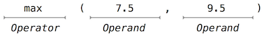
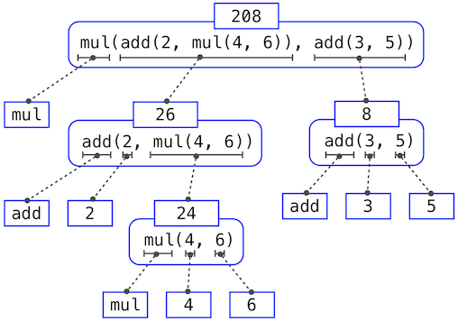

# Getting Started

Computer science is a tremendously broad academic discipline. The areas of globally distributed systems, artificial intelligence, robotics, graphics, security, scientific computing, computer architecture, and dozens of emerging sub-fields all expand with new techniques and discoveries every year. The rapid progress of computer science has left few aspects of human life unaffected. Commerce, communication, science, art, leisure, and politics have all been reinvented as computational domains.

The high productivity of computer science is only possible because the discipline is built upon an elegant and powerful set of fundamental ideas. All computing begins with representing information, specifying logic to process it, and designing abstractions that manage the complexity of that logic. Mastering these fundamentals will require us to understand precisely how computers interpret computer programs and carry out computational processes.

## Programming in Python

> A language isn't something you learn so much as something you join.
>
> — [Arika Okrent](http://arikaokrent.com/)

n order to define computational processes, we need a programming language; preferably one that many humans and a great variety of computers can all understand. In this text, we will work primarily with the [Python](http://docs.python.org/py3k/) language.

Python is a widely used programming language that has recruited enthusiasts from many professions: web programmers, game engineers, scientists, academics, and even designers of new programming languages. When you learn Python, you join a million-person-strong community of developers. Developer communities are tremendously important institutions: members help each other solve problems, share their projects and experiences, and collectively develop software and tools. Dedicated members often achieve celebrity and widespread esteem for their contributions.

The Python language itself is the product of a [large volunteer community](http://www.python.org/psf/members/) that prides itself on the [diversity](http://python.org/community/diversity/) of its contributors. The language was conceived and first implemented by [Guido van Rossum](http://en.wikipedia.org/wiki/Guido_van_Rossum) in the late 1980's. The first chapter of his [Python 3 Tutorial](http://docs.python.org/py3k/tutorial/appetite.html) explains why Python is so popular, among the many languages available today.

Python excels as an instructional language because, throughout its history, Python's developers have emphasized the human interpretability of Python code, reinforced by the [Zen of Python](http://www.python.org/dev/peps/pep-0020/) guiding principles of beauty, simplicity, and readability. Python is particularly appropriate for this text because its broad set of features support a variety of different programming styles, which we will explore. While there is no single way to program in Python, there are a set of conventions shared across the developer community that facilitate reading, understanding, and extending existing programs. Python's combination of great flexibility and accessibility allows students to explore many programming paradigms, and then apply their newly acquired knowledge to thousands of [ongoing projects](http://pypi.python.org/pypi).

## Installing Python 3

As with all great software, Python has many versions. This text will use the most recent stable version of Python 3. Many computers have older versions of Python installed already, such as Python 2.7, but those will not match the descriptions in this text. You should be able to use any computer, but expect to install Python 3. (Don't worry, Python is free.)

You can download Python 3 from the Python downloads page by clicking on the version that begins with 3 (not 2). Follow the instructions of the installer to complete installation.

For further guidance, try these video tutorials on [Windows installation](http://www.youtube.com/watch?v=54-wuFsPi0w) and [Mac installation](http://www.youtube.com/watch?v=smHuBHxJdK8) of Python 3, created by Julia Oh.

## Interactive Sessions

In an interactive Python session, you type some Python *code* after the *prompt*, `>>>`. The Python *interpreter* reads and executes what you type, carrying out your various commands.

To start an interactive session, run the Python 3 application. Type `python3` at a terminal prompt (Mac/Unix/Linux) or open the Python 3 application in Windows.

If you see the Python prompt, `>>>`, then you have successfully started an interactive session. These notes depict example interactions using the prompt, followed by some input.

```python
>>> 2 + 2
4
```

**Interactive controls.** Each session keeps a history of what you have typed. To access that history, press `<Control>-P` (previous) and `<Control>-N` (next). `<Control>-D` exits a session, which discards this history. Up and down arrows also cycle through history on some systems.

## First Example

> And, as imagination bodies forth
>
> The forms of things to unknown, and the poet's pen
>
> Turns them to shapes, and gives to airy nothing
>
> A local habitation and a name.
>
> —William Shakespeare, A Midsummer-Night's Dream

To give Python a proper introduction, we will begin with an example that uses several language features. In the next section, we will start from scratch and build up the language piece by piece. Think of this section as a sneak preview of features to come.

Python has built-in support for a wide range of common programming activities, such as manipulating text, displaying graphics, and communicating over the Internet. The line of Python code

```python
>>> from urllib.request import urlopen
```

is an `import` statement that loads functionality for accessing data on the Internet. In particular, it makes available a function called `urlopen`, which can access the content at a uniform resource locator (URL), a location of something on the Internet.

**Statements & Expressions**. Python code consists of expressions and statements. Broadly, computer programs consist of instructions to either

1. Compute some value
2. Carry out some action

Statements typically describe actions. When the Python interpreter executes a statement, it carries out the corresponding action. On the other hand, expressions typically describe computations. When Python evaluates an expression, it computes the value of that expression. This chapter introduces several types of statements and expressions.

The assignment statement

```python
>>> shakespeare = urlopen('http://composingprograms.com/shakespeare.txt')
```

associates the name `shakespeare` with the value of the expression that follows `=`. That expression applies the `urlopen` function to a URL that contains the complete text of William Shakespeare's 37 plays, all in a single text document.

**Functions**. Functions encapsulate logic that manipulates data. `urlopen` is a function. A web address is a piece of data, and the text of Shakespeare's plays is another. The process by which the former leads to the latter may be complex, but we can apply that process using only a simple expression because that complexity is tucked away within a function. Functions are the primary topic of this chapter.

Another assignment statement

```python
>>> words = set(shakespeare.read().decode().split())
```

associates the name `words` to the set of all unique words that appear in Shakespeare's plays, all 33,721 of them. The chain of commands to `read`, `decode`, and `split`, each operate on an intermediate computational entity: we `read` the data from the opened URL, then `decode` the data into text, and finally `split` the text into words. All of those words are placed in a `set`.

**Objects**. A `set` is a type of object, one that supports set operations like computing intersections and membership. An object seamlessly bundles together data and the logic that manipulates that data, in a way that manages the complexity of both. Objects are the primary topic of Chapter 2. Finally, the expression

```python
>>> {w for w in words if len(w) == 6 and w[::-1] in words}
{'redder', 'drawer', 'reward', 'diaper', 'repaid'}
```

is a compound expression that evaluates to the set of all Shakespearian words that are simultaneously a word spelled in reverse. The cryptic notation `w[::-1]` enumerates each letter in a word, but the `-1` dictates to step backwards. When you enter an expression in an interactive session, Python prints its value on the following line.

**Interpreters**. Evaluating compound expressions requires a precise procedure that interprets code in a predictable way. A program that implements such a procedure, evaluating compound expressions, is called an interpreter. The design and implementation of interpreters is the primary topic of Chapter 3.

When compared with other computer programs, interpreters for programming languages are unique in their generality. Python was not designed with Shakespeare in mind. However, its great flexibility allowed us to process a large amount of text with only a few statements and expressions.

In the end, we will find that all of these core concepts are closely related: functions are objects, objects are functions, and interpreters are instances of both. However, developing a clear understanding of each of these concepts and their role in organizing code is critical to mastering the art of programming.

## Elements of Programming

A programming language is more than just a means for instructing a computer to perform tasks. The language also serves as a framework within which we organize our ideas about computational processes. Programs serve to communicate those ideas among the members of a programming community. Thus, programs must be written for people to read, and only incidentally for machines to execute.

When we describe a language, we should pay particular attention to the means that the language provides for combining simple ideas to form more complex ideas. Every powerful language has three such mechanisms:

- **primitive expressions and statements**, which represent the simplest building blocks that the language provides,
- **means of combination**, by which compound elements are built from simpler ones, and
- **means of abstraction**, by which compound elements can be named and manipulated as units.

In programming, we deal with two kinds of elements: functions and data. (Soon we will discover that they are really not so distinct.) Informally, data is stuff that we want to manipulate, and functions describe the rules for manipulating the data. Thus, any powerful programming language should be able to describe primitive data and primitive functions, as well as have some methods for combining and abstracting both functions and data.

## Expressions

Having experimented with the full Python interpreter in the previous section, we now start anew, methodically developing the Python language element by element. Be patient if the examples seem simplistic — more exciting material is soon to come.

We begin with primitive expressions. One kind of primitive expression is a number. More precisely, the expression that you type consists of the numerals that represent the number in base 10.

```python
>>> 42
42
```

Expressions representing numbers may be combined with mathematical operators to form a compound expression, which the interpreter will evaluate:

```python
>>> -1 - -1
0
>>> 1/2 + 1/4 + 1/8 + 1/16 + 1/32 + 1/64 + 1/128
0.9921875
```

These mathematical expressions use *infix* notation, where the *operator* (e.g., `+`, `-`, `*`, or `/`) appears in between the *operands* (numbers). Python includes many ways to form compound expressions. Rather than attempt to enumerate them all immediately, we will introduce new expression forms as we go, along with the language features that they support.

## Call Expressions

The most important kind of compound expression is a *call expression*, which applies a function to some arguments. Recall from algebra that the mathematical notion of a function is a mapping from some input arguments to an output value. For instance, the `max` function maps its inputs to a single output, which is the largest of the inputs. The way in which Python expresses function application is the same as in conventional mathematics.

```
>>> max(7.5, 9.5)
9.5
```

This call expression has subexpressions: the *operator* is an expression that precedes parentheses, which enclose a comma-delimited list of *operand* expressions.



The operator specifies a *function*. When this call expression is evaluated, we say that the function `max` is *called* with *arguments* 7.5 and 9.5, and *returns* a *value* of 9.5.

The order of the arguments in a call expression matters. For instance, the function `pow` raises its first argument to the power of its second argument.

```python
>>> pow(100, 2)
10000
>>> pow(2, 100)
1267650600228229401496703205376
```

Function notation has three principal advantages over the mathematical convention of infix notation. First, functions may take an arbitrary number of arguments:

```python
>>> max(1, -2, 3, -4)
3
```

No ambiguity can arise, because the function name always precedes its arguments.

Second, function notation extends in a straightforward way to *nested* expressions, where the elements are themselves compound expressions. In nested call expressions, unlike compound infix expressions, the structure of the nesting is entirely explicit in the parentheses.

```python
>>> max(min(1, -2), min(pow(3, 5), -4))
-2
```

There is no limit (in principle) to the depth of such nesting and to the overall complexity of the expressions that the Python interpreter can evaluate. However, humans quickly get confused by multi-level nesting. An important role for you as a programmer is to structure expressions so that they remain interpretable by yourself, your programming partners, and other people who may read your expressions in the future.

Third, mathematical notation has a great variety of forms: multiplication appears between terms, exponents appear as superscripts, division as a horizontal bar, and a square root as a roof with slanted siding. Some of this notation is very hard to type! However, all of this complexity can be unified via the notation of call expressions. While Python supports common mathematical operators using infix notation (like `+` and `-`), any operator can be expressed as a function with a name.

## Importing Library Functions

Python defines a very large number of functions, including the operator functions mentioned in the preceding section, but does not make all of their names available by default. Instead, it organizes the functions and other quantities that it knows about into modules, which together comprise the Python Library. To use these elements, one imports them. For example, the `math` module provides a variety of familiar mathematical functions:

```python
>>> from math import sqrt
>>> sqrt(256)
16.0
```

and the `operator` module provides access to functions corresponding to infix operators:

```python
>>> from operator import add, sub, mul
>>> add(14, 28)
42
>>> sub(100, mul(7, add(8, 4)))
16
```

An `import` statement designates a module name (e.g., `operator` or `math`), and then lists the named attributes of that module to import (e.g., `sqrt`). Once a function is imported, it can be called multiple times.

There is no difference between using these operator functions (e.g., `add`) and the operator symbols themselves (e.g., `+`). Conventionally, most programmers use symbols and infix notation to express simple arithmetic.

The [Python 3 Library Docs](http://docs.python.org/py3k/library/index.html) list the functions defined by each module, such as the [math module](http://docs.python.org/py3k/library/math.html). However, this documentation is written for developers who know the whole language well. For now, you may find that experimenting with a function tells you more about its behavior than reading the documentation. As you become familiar with the Python language and vocabulary, this documentation will become a valuable reference source.

### Names and the Environment

**Video:** Show Hide

A critical aspect of a programming language is the means it provides for using names to refer to computational objects. If a value has been given a name, we say that the name *binds* to the value.

In Python, we can establish new bindings using the assignment statement, which contains a name to the left of `=` and a value to the right:

```python
>>> radius = 10
>>> radius
10
>>> 2 * radius
20
```

Names are also bound via `import` statements.

```python
>>> from math import pi
>>> pi * 71 / 223
1.0002380197528042
```

The `=` symbol is called the *assignment* operator in Python (and many other languages). Assignment is our simplest means of *abstraction*, for it allows us to use simple names to refer to the results of compound operations, such as the `area` computed above. In this way, complex programs are constructed by building, step by step, computational objects of increasing complexity.

The possibility of binding names to values and later retrieving those values by name means that the interpreter must maintain some sort of memory that keeps track of the names, values, and bindings. This memory is called an *environment*.

Names can also be bound to functions. For instance, the name `max` is bound to the max function we have been using. Functions, unlike numbers, are tricky to render as text, so Python prints an identifying description instead, when asked to describe a function:

```python
>>> max
<built-in function max>
```

We can use assignment statements to give new names to existing functions.

```python
>>> f = max
>>> f
<built-in function max>
>>> f(2, 3, 4)
4
```

And successive assignment statements can rebind a name to a new value.

```python
>>> f = 2
>>> f
2
```

In Python, names are often called *variable names* or *variables* because they can be bound to different values in the course of executing a program. When a name is bound to a new value through assignment, it is no longer bound to any previous value. One can even bind built-in names to new values.

```python
>>> max = 5
>>> max
5
```

After assigning `max` to 5, the name `max` is no longer bound to a function, and so attempting to call `max(2, 3, 4)` will cause an error.

When executing an assignment statement, Python evaluates the expression to the right of `=` before changing the binding to the name on the left. Therefore, one can refer to a name in right-side expression, even if it is the name to be bound by the assignment statement.

```python
>>> x = 2
>>> x = x + 1
>>> x
3
```

We can also assign multiple values to multiple names in a single statement, where names on the left of `=` and expressions on the right of `=` are separated by commas.

```python
>>> area, circumference = pi * radius * radius, 2 * pi * radius
>>> area
314.1592653589793
>>> circumference
62.83185307179586
```

Changing the value of one name does not affect other names. Below, even though the name `area` was bound to a value defined originally in terms of `radius`, the value of `area` has not changed. Updating the value of `area` requires another assignment statement.

```python
>>> radius = 11
>>> area
314.1592653589793
>>> area = pi * radius * radius
380.132711084365
```

With multiple assignment, *all* expressions to the right of `=` are evaluated before *any* names to the left are bound to those values. As a result of this rule, swapping the values bound to two names can be performed in a single statement.

```python
>>> x, y = 3, 4.5
>>> y, x = x, y
>>> x
4.5
>>> y
3
```

### 1.2.5  Evaluating Nested Expressions

One of our goals in this chapter is to isolate issues about thinking procedurally. As a case in point, let us consider that, in evaluating nested call expressions, the interpreter is itself following a procedure.

To evaluate a call expression, Python will do the following:

1. Evaluate the operator and operand subexpressions, then
2. Apply the function that is the value of the operator subexpression to the arguments that are the values of the operand subexpressions.

Even this simple procedure illustrates some important points about processes in general. The first step dictates that in order to accomplish the evaluation process for a call expression we must first evaluate other expressions. Thus, the evaluation procedure is *recursive* in nature; that is, it includes, as one of its steps, the need to invoke the rule itself.

For example, evaluating

```python
>>> sub(pow(2, add(1, 10)), pow(2, 5))
2016
```

requires that this evaluation procedure be applied four times. If we draw each expression that we evaluate, we can visualize the hierarchical structure of this process.



This illustration is called an *expression tree*. In computer science, trees conventionally grow from the top down. The objects at each point in a tree are called nodes; in this case, they are expressions paired with their values.

Evaluating its root, the full expression at the top, requires first evaluating the branches that are its subexpressions. The leaf expressions (that is, nodes with no branches stemming from them) represent either functions or numbers. The interior nodes have two parts: the call expression to which our evaluation rule is applied, and the result of that expression. Viewing evaluation in terms of this tree, we can imagine that the values of the operands percolate upward, starting from the terminal nodes and then combining at higher and higher levels.

Next, observe that the repeated application of the first step brings us to the point where we need to evaluate, not call expressions, but primitive expressions such as numerals (e.g., 2) and names (e.g., `add`). We take care of the primitive cases by stipulating that

- A numeral evaluates to the number it names,
- A name evaluates to the value associated with that name in the current environment.

Notice the important role of an environment in determining the meaning of the symbols in expressions. In Python, it is meaningless to speak of the value of an expression such as

```python
>>> add(x, 1)
```

without specifying any information about the environment that would provide a meaning for the name `x` (or even for the name `add`). Environments provide the context in which evaluation takes place, which plays an important role in our understanding of program execution.

This evaluation procedure does not suffice to evaluate all Python code, only call expressions, numerals, and names. For instance, it does not handle assignment statements. Executing

```python
>>> x = 3
```

does not return a value nor evaluate a function on some arguments, since the purpose of assignment is instead to bind a name to a value. In general, statements are not evaluated but *executed*; they do not produce a value but instead make some change. Each type of expression or statement has its own evaluation or execution procedure.

A pedantic note: when we say that "a numeral evaluates to a number," we actually mean that the Python interpreter evaluates a numeral to a number. It is the interpreter which endows meaning to the programming language. Given that the interpreter is a fixed program that always behaves consistently, we can say that numerals (and expressions) themselves evaluate to values in the context of Python programs.

# Errors

Python is waiting for your command. You are encouraged to experiment with the language, even though you may not yet know its full vocabulary and structure. However, be prepared for errors. While computers are tremendously fast and flexible, they are also extremely rigid. The nature of computers is described in [Stanford's introductory course](http://web.stanford.edu/class/cs101/code-1-introduction.html) as

> The fundamental equation of computers is: `computer = powerful + stupid`
>
> Computers are very powerful, looking at volumes of data very quickly. Computers can perform billions of operations per second, where each operation is pretty simple.
>
> Computers are also shockingly stupid and fragile. The operations that they can do are extremely rigid, simple, and mechanical. The computer lacks anything like real insight ... it's nothing like the HAL 9000 from the movies. If nothing else, you should not be intimidated by the computer as if it's some sort of brain. It's very mechanical underneath it all.
>
> Programming is about a person using their real insight to build something useful, constructed out of these teeny, simple little operations that the computer can do.
>
> —Francisco Cai and Nick Parlante, Stanford CS101

The rigidity of computers will immediately become apparent as you experiment with the Python interpreter: even the smallest spelling and formatting changes will cause unexpected output and errors.

Learning to interpret errors and diagnose the cause of unexpected errors is called *debugging*. Some guiding principles of debugging are:

1. **Test incrementally**: Every well-written program is composed of small, modular components that can be tested individually. Try out everything you write as soon as possible to identify problems early and gain confidence in your components.
2. **Isolate errors**: An error in the output of a statement can typically be attributed to a particular modular component. When trying to diagnose a problem, trace the error to the smallest fragment of code you can before trying to correct it.
3. **Check your assumptions**: Interpreters do carry out your instructions to the letter — no more and no less. Their output is unexpected when the behavior of some code does not match what the programmer believes (or assumes) that behavior to be. Know your assumptions, then focus your debugging effort on verifying that your assumptions actually hold.
4. **Consult others**: You are not alone! If you don't understand an error message, ask a friend, instructor, or search engine. If you have isolated an error, but can't figure out how to correct it, ask someone else to take a look. A lot of valuable programming knowledge is shared in the process of group problem solving.

Incremental testing, modular design, precise assumptions, and teamwork are themes that persist throughout this text. Hopefully, they will also persist throughout your computer science career.
