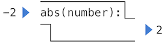
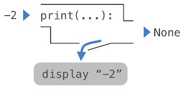

## Defining New Functions

We have identified in Python some of the elements that must appear in any powerful programming language:

1. Numbers and arithmetic operations are *primitive* built-in data values and functions.
2. Nested function application provides a means of *combining* operations.
3. Binding names to values provides a limited means of *abstraction*.

Now we will learn about *function definitions*, a much more powerful abstraction technique by which a name can be bound to compound operation, which can then be referred to as a unit.

We begin by examining how to express the idea of *squaring*. We might say, "To square something, multiply it by itself." This is expressed in Python as

```python
>>> def square(x):
        return mul(x, x)
```

which defines a new function that has been given the name `square`. This user-defined function is not built into the interpreter. It represents the compound operation of multiplying something by itself. The `x` in this definition is called a *formal parameter*, which provides a name for the thing to be multiplied. The definition creates this user-defined function and associates it with the name `square`.

**How to define a function.** Function definitions consist of a `def` statement that indicates a `<name>` and a comma-separated list of named `<formal parameters>`, then a `return` statement, called the function body, that specifies the `<return expression>` of the function, which is an expression to be evaluated whenever the function is applied:

```python
def <name>(<formal parameters>):
    return <return expression>
```

The second line *must* be indented — most programmers use four spaces to indent. The return expression is not evaluated right away; it is stored as part of the newly defined function and evaluated only when the function is eventually applied.

Having defined `square`, we can apply it with a call expression:

```python
>>> square(21)
441
>>> square(add(2, 5))
49
>>> square(square(3))
81
```

We can also use `square` as a building block in defining other functions. For example, we can easily define a function `sum_squares` that, given any two numbers as arguments, returns the sum of their squares:

```python
>>> def sum_squares(x, y):
        return add(square(x), square(y))
>>> sum_squares(3, 4)
25
```

User-defined functions are used in exactly the same way as built-in functions. Indeed, one cannot tell from the definition of `sum_squares` whether `square` is built into the interpreter, imported from a module, or defined by the user.

Both `def` statements and assignment statements bind names to values, and any existing bindings are lost. For example, `g` below first refers to a function of no arguments, then a number, and then a different function of two arguments.

```python
>>> def g():
        return 1
>>> g()
1
>>> g = 2
>>> g
2
>>> def g(h, i):
        return h + i
>>> g(1, 2)
3
```

## The Non-Pure Print Function

Throughout this text, we will distinguish between two types of functions.

**Pure functions.** Functions have some input (their arguments) and return some output (the result of applying them). The built-in function

```python
>>> abs(-2)
2
```

can be depicted as a small machine that takes input and produces output.



The function `abs` is *pure*. Pure functions have the property that applying them has no effects beyond returning a value. Moreover, a pure function must always return the same value when called twice with the same arguments.

**Non-pure functions.** In addition to returning a value, applying a non-pure function can generate *side effects*, which make some change to the state of the interpreter or computer. A common side effect is to generate additional output beyond the return value, using the `print` function.

```python
>>> print(1, 2, 3)
1 2 3
```

While `print` and `abs` may appear to be similar in these examples, they work in fundamentally different ways. The value that `print` returns is always `None`, a special Python value that represents nothing. The interactive Python interpreter does not automatically print the value `None`. In the case of `print`, the function itself is printing output as a side effect of being called.



A nested expression of calls to `print` highlights the non-pure character of the function.

```python
>>> print(print(1), print(2))
1
2
None None
```

If you find this output to be unexpected, draw an expression tree to clarify why evaluating this expression produces this peculiar output.

Be careful with `print`! The fact that it returns `None` means that it *should not* be the expression in an assignment statement.

```python
>>> two = print(2)
2
>>> print(two)
None
```

Pure functions are restricted in that they cannot have side effects or change behavior over time. Imposing these restrictions yields substantial benefits. First, pure functions can be composed more reliably into compound call expressions. We can see in the non-pure function example above that `print` does not return a useful result when used in an operand expression. On the other hand, we have seen that functions such as `max`, `pow` and `sqrt` can be used effectively in nested expressions.

Second, pure functions tend to be simpler to test. A list of arguments will always lead to the same return value, which can be compared to the expected return value. Testing is discussed in more detail later in this chapter.

Third, Chapter 4 will illustrate that pure functions are essential for writing *concurrent* programs, in which multiple call expressions may be evaluated simultaneously.

By contrast, Chapter 2 investigates a range of non-pure functions and describes their uses.

For these reasons, we concentrate heavily on creating and using pure functions in the remainder of this chapter. The `print` function is only used so that we can see the intermediate results of computations.

## Environments

Our subset of Python is now complex enough that the meaning of programs is non-obvious. What if a formal parameter has the same name as a built-in function? Can two functions share names without confusion? To resolve such questions, we must describe environments in more detail.

An environment in which an expression is evaluated consists of a sequence of *frames*, depicted as boxes. Each frame contains *bindings*, each of which associates a name with its corresponding value. There is a single *global* frame. Assignment and import statements add entries to the first frame of the current environment. So far, our environment consists only of the global frame.

<iframe width="800" height="500" frameborder="0" src="https://pythontutor.com/iframe-embed.html#code=from%20math%20import%20pi%0Atau%20%3D%202%20*%20pi&codeDivHeight=400&codeDivWidth=350&cumulative=false&curInstr=0&heapPrimitives=nevernest&origin=opt-frontend.js&py=3&rawInputLstJSON=%5B%5D&textReferences=false"> </iframe>

This *environment diagram* shows the bindings of the current environment, along with the values to which names are bound. The environment diagrams in this text are interactive: you can step through the lines of the small program on the left to see the state of the environment evolve on the right. You can also click on the "Edit code in Online Python Tutor" link to load the example into the [Online Python Tutor](http://composingprograms.com/tutor.html), a tool created by [Philip Guo](http://www.pgbovine.net/) for generating these environment diagrams. You are encouraged to create examples yourself and study the resulting environment diagrams.

Functions appear in environment diagrams as well. An `import` statement binds a name to a built-in function. A `def` statement binds a name to a user-defined function created by the definition. The resulting environment after importing `mul` and defining `square` appears below:

<iframe width="800" height="500" frameborder="0" src="https://pythontutor.com/iframe-embed.html#code=from%20operator%20import%20mul%0Adef%20square%28x%29%3A%0A%20%20%20%20return%20mul%28x,%20x%29&codeDivHeight=400&codeDivWidth=350&cumulative=false&curInstr=0&heapPrimitives=nevernest&origin=opt-frontend.js&py=3&rawInputLstJSON=%5B%5D&textReferences=false"> </iframe>

Each function is a line that starts with `func`, followed by the function name and formal parameters. Built-in functions such as `mul` do not have formal parameter names, and so `...` is always used instead.

The name of a function is repeated twice, once in the frame and again as part of the function itself. The name appearing in the function is called the *intrinsic name*. The name in a frame is a *bound name*. There is a difference between the two: different names may refer to the same function, but that function itself has only one intrinsic name.

The name bound to a function in a frame is the one used during evaluation. The intrinsic name of a function does not play a role in evaluation. Step through the example below using the *Forward* button to see that once the name `max` is bound to the value 3, it can no longer be used as a function.

<iframe width="800" height="500" frameborder="0" src="https://pythontutor.com/iframe-embed.html#code=f%20%3D%20max%0Amax%20%3D%203%0Aresult%20%3D%20f%282,%203,%204%29%0Amax%281,%202%29%20%20%23%20Causes%20an%20error&codeDivHeight=400&codeDivWidth=350&cumulative=false&curInstr=4&heapPrimitives=nevernest&origin=opt-frontend.js&py=3&rawInputLstJSON=%5B%5D&textReferences=false"> </iframe>

The error message `TypeError: 'int' object is not callable` is reporting that the name `max` (currently bound to the number 3) is an integer and not a function. Therefore, it cannot be used as the operator in a call expression.

**Function Signatures.** Functions differ in the number of arguments that they are allowed to take. To track these requirements, we draw each function in a way that shows the function name and its formal parameters. The user-defined function `square` takes only `x`; providing more or fewer arguments will result in an error. A description of the formal parameters of a function is called the function's signature.

The function `max` can take an arbitrary number of arguments. It is rendered as `max(...)`. Regardless of the number of arguments taken, all built-in functions will be rendered as `<name>(...)`, because these primitive functions were never explicitly defined.