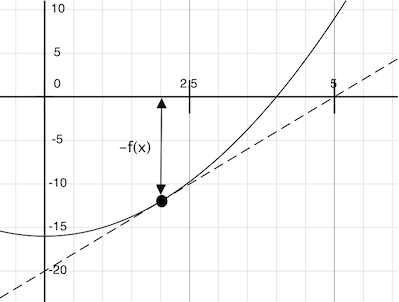
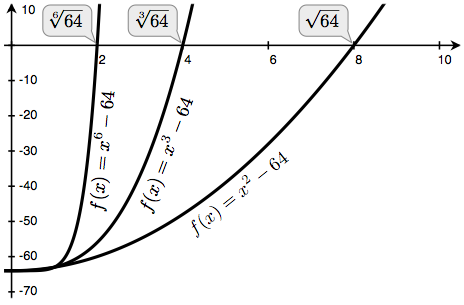

## Higher-Order Functions

We have seen that functions are a method of abstraction that describe compound operations independent of the particular values of their arguments. That is, in `square`,

```python
>>> def square(x):
        return x * x
```

we are not talking about the square of a particular number, but rather about a method for obtaining the square of any number. Of course, we could get along without ever defining this function, by always writing expressions such as

```python
>>> 3 * 3
9
>>> 5 * 5
25
```

and never mentioning `square` explicitly. This practice would suffice for simple computations such as `square`, but would become arduous for more complex examples such as `abs` or `fib`. In general, lacking function definition would put us at the disadvantage of forcing us to work always at the level of the particular operations that happen to be primitives in the language (multiplication, in this case) rather than in terms of higher-level operations. Our programs would be able to compute squares, but our language would lack the ability to express the concept of squaring.

One of the things we should demand from a powerful programming language is the ability to build abstractions by assigning names to common patterns and then to work in terms of the names directly. Functions provide this ability. As we will see in the following examples, there are common programming patterns that recur in code, but are used with a number of different functions. These patterns can also be abstracted, by giving them names.

To express certain general patterns as named concepts, we will need to construct functions that can accept other functions as arguments or return functions as values. Functions that manipulate functions are called higher-order functions. This section shows how higher-order functions can serve as powerful abstraction mechanisms, vastly increasing the expressive power of our language.

## Functions as Arguments

Consider the following three functions, which all compute summations. The first, `sum_naturals`, computes the sum of natural numbers up to `n`:

```python
>>> def sum_naturals(n):
        total, k = 0, 1
        while k <= n:
            total, k = total + k, k + 1
        return total
>>> sum_naturals(100)
5050
```

The second, `sum_cubes`, computes the sum of the cubes of natural numbers up to `n`.

```python
>>> def sum_cubes(n):
        total, k = 0, 1
        while k <= n:
            total, k = total + k*k*k, k + 1
        return total
>>> sum_cubes(100)
25502500
```

The third, `pi_sum`, computes the sum of terms in the series
$$
\frac{8}{1\cdot 3} +  \frac{8}{5\cdot 7} + \frac{8}{9\cdot 11} + \cdots
$$
which converges to pi very slowly.

```python
>>> def pi_sum(n):
        total, k = 0, 1
        while k <= n:
            total, k = total + 8 / ((4*k-3) * (4*k-1)), k + 1
        return total
>>> pi_sum(100)
3.1365926848388144
```

These three functions clearly share a common underlying pattern. They are for the most part identical, differing only in name and the function of `k` used to compute the term to be added. We could generate each of the functions by filling in slots in the same template:

```python
def <name>(n):
    total, k = 0, 1
    while k <= n:
        total, k = total + <term>(k), k + 1
    return total
```

The presence of such a common pattern is strong evidence that there is a useful abstraction waiting to be brought to the surface. Each of these functions is a summation of terms. As program designers, we would like our language to be powerful enough so that we can write a function that expresses the concept of summation itself rather than only functions that compute particular sums. We can do so readily in Python by taking the common template shown above and transforming the "slots" into formal parameters:

In the example below, `summation` takes as its two arguments the upper bound `n` together with the function `term` that computes the kth term. We can use `summation` just as we would any function, and it expresses summations succinctly. Take the time to step through this example, and notice how binding `cube` to the local names `term` ensures that the result `1*1*1 + 2*2*2 + 3*3*3 = 36` is computed correctly. In this example, frames which are no longer needed are removed to save space.

<iframe width="800" height="500" frameborder="0" src="https://pythontutor.com/iframe-embed.html#code=def%20summation%28n,%20term%29%3A%0A%20%20%20%20total,%20k%20%3D%200,%201%0A%20%20%20%20while%20k%20%3C%3D%20n%3A%0A%20%20%20%20%20%20%20%20total,%20k%20%3D%20total%20%2B%20term%28k%29,%20k%20%2B%201%0A%20%20%20%20return%20total%0A%0Adef%20cube%28x%29%3A%0A%20%20%20%20return%20x*x*x%0A%0Adef%20sum_cubes%28n%29%3A%0A%20%20%20%20return%20summation%28n,%20cube%29%0A%0Aresult%20%3D%20sum_cubes%283%29&codeDivHeight=400&codeDivWidth=350&cumulative=false&curInstr=3&heapPrimitives=nevernest&origin=opt-frontend.js&py=3&rawInputLstJSON=%5B%5D&textReferences=false"> </iframe>

Using an `identity` function that returns its argument, we can also sum natural numbers using exactly the same `summation` function.

```python
>>> def summation(n, term):
        total, k = 0, 1
        while k <= n:
            total, k = total + term(k), k + 1
        return total
>>> def identity(x):
        return x
>>> def sum_naturals(n):
        return summation(n, identity)
>>> sum_naturals(10)
55
```

The `summation` function can also be called directly, without definining another function for a specific sequence.

```python
>>> summation(10, square)
385
```

We can define `pi_sum` using our `summation` abstraction by defining a function `pi_term` to compute each term. We pass the argument `1e6`, a shorthand for `1 * 10^6 = 1000000`, to generate a close approximation to pi.

```python
>>> def pi_term(x):
        return 8 / ((4*x-3) * (4*x-1))
>>> def pi_sum(n):
        return summation(n, pi_term)
>>> pi_sum(1e6)
3.141592153589902
```

## Functions as General Methods

We introduced user-defined functions as a mechanism for abstracting patterns of numerical operations so as to make them independent of the particular numbers involved. With higher-order functions, we begin to see a more powerful kind of abstraction: some functions express general methods of computation, independent of the particular functions they call.

Despite this conceptual extension of what a function means, our environment model of how to evaluate a call expression extends gracefully to the case of higher-order functions, without change. When a user-defined function is applied to some arguments, the formal parameters are bound to the values of those arguments (which may be functions) in a new local frame.

Consider the following example, which implements a general method for iterative improvement and uses it to compute the [golden ratio](http://www.geom.uiuc.edu/~demo5337/s97b/art.htm). The golden ratio, often called "phi", is a number near 1.6 that appears frequently in nature, art, and architecture.

An iterative improvement algorithm begins with a `guess` of a solution to an equation. It repeatedly applies an `update` function to improve that guess, and applies a `close` comparison to check whether the current `guess` is "close enough" to be considered correct.

```python
>>> def improve(update, close, guess=1):
        while not close(guess):
            guess = update(guess)
        return guess
```

This `improve` function is a general expression of repetitive refinement. It doesn't specify what problem is being solved: those details are left to the `update` and `close` functions passed in as arguments.

Among the well-known properties of the golden ratio are that it can be computed by repeatedly summing the inverse of any positive number with 1, and that it is one less than its square. We can express these properties as functions to be used with `improve`.

```python
>>> def golden_update(guess):
        return 1/guess + 1
>>> def square_close_to_successor(guess):
        return approx_eq(guess * guess, guess + 1)
```

Above, we introduce a call to `approx_eq` that is meant to return `True` if its arguments are approximately equal to each other. To implement, `approx_eq`, we can compare the absolute value of the difference between two numbers to a small tolerance value.

```python
>>> def approx_eq(x, y, tolerance=1e-15):
        return abs(x - y) < tolerance
```

Calling `improve` with the arguments `golden_update` and `square_close_to_successor` will compute a finite approximation to the golden ratio.

```python
>>> improve(golden_update, square_close_to_successor)
1.6180339887498951
```

By tracing through the steps of evaluation, we can see how this result is computed. First, a local frame for `improve` is constructed with bindings for `update`, `close`, and `guess`. In the body of `improve`, the name `close` is bound to `square_close_to_successor`, which is called on the initial value of `guess`. Trace through the rest of the steps to see the computational process that evolves to compute the golden ratio.

<iframe width="800" height="500" frameborder="0" src="https://pythontutor.com/iframe-embed.html#code=def%20improve%28update,%20close,%20guess%3D1%29%3A%0A%20%20%20%20while%20not%20close%28guess%29%3A%0A%20%20%20%20%20%20%20%20guess%20%3D%20update%28guess%29%0A%20%20%20%20return%20guess%0A%0Adef%20golden_update%28guess%29%3A%0A%20%20%20%20return%201/guess%20%2B%201%0A%0Adef%20square_close_to_successor%28guess%29%3A%0A%20%20%20%20return%20approx_eq%28guess%20*%20guess,%0A%20%20%20%20%20%20%20%20%20%20%20%20%20%20%20%20%20%20%20%20%20guess%20%2B%201%29%0A%0Adef%20approx_eq%28x,%20y,%20tolerance%3D1e-3%29%3A%0A%20%20%20%20return%20abs%28x%20-%20y%29%20%3C%20tolerance%0A%0Aphi%20%3D%20improve%28golden_update,%0A%20%20%20%20%20%20%20%20%20%20%20%20%20%20square_close_to_successor%29&codeDivHeight=400&codeDivWidth=350&cumulative=false&curInstr=7&heapPrimitives=nevernest&origin=opt-frontend.js&py=3&rawInputLstJSON=%5B%5D&textReferences=false"> </iframe>

This example illustrates two related big ideas in computer science. First, naming and functions allow us to abstract away a vast amount of complexity. While each function definition has been trivial, the computational process set in motion by our evaluation procedure is quite intricate. Second, it is only by virtue of the fact that we have an extremely general evaluation procedure for the Python language that small components can be composed into complex processes. Understanding the procedure of interpreting programs allows us to validate and inspect the process we have created.

As always, our new general method `improve` needs a test to check its correctness. The golden ratio can provide such a test, because it also has an exact closed-form solution, which we can compare to this iterative result.

```python
>>> from math import sqrt
>>> phi = 1/2 + sqrt(5)/2
>>> def improve_test():
        approx_phi = improve(golden_update, square_close_to_successor)
        assert approx_eq(phi, approx_phi), 'phi differs from its approximation'
>>> improve_test()
```

For this test, no news is good news: `improve_test` returns `None` after its `assert` statement is executed successfully.

### Defining Functions III: Nested Definitions

The above examples demonstrate how the ability to pass functions as arguments significantly enhances the expressive power of our programming language. Each general concept or equation maps onto its own short function. One negative consequence of this approach is that the global frame becomes cluttered with names of small functions, which must all be unique. Another problem is that we are constrained by particular function signatures: the `update` argument to `improve` must take exactly one argument. Nested function definitions address both of these problems, but require us to enrich our environment model.

Let's consider a new problem: computing the square root of a number. In programming languages, "square root" is often abbreviated as `sqrt`. Repeated application of the following update converges to the square root of `a`:

```python
>>> def average(x, y):
        return (x + y)/2
>>> def sqrt_update(x, a):
        return average(x, a/x)
```

This two-argument update function is incompatible with `improve` (it takes two arguments, not one), and it provides only a single update, while we really care about taking square roots by repeated updates. The solution to both of these issues is to place function definitions inside the body of other definitions.

```python
>>> def sqrt(a):
        def sqrt_update(x):
            return average(x, a/x)
        def sqrt_close(x):
            return approx_eq(x * x, a)
        return improve(sqrt_update, sqrt_close)
```

Like local assignment, local `def` statements only affect the current local frame. These functions are only in scope while `sqrt` is being evaluated. Consistent with our evaluation procedure, these local `def` statements don't even get evaluated until `sqrt` is called.

**Lexical scope.** Locally defined functions also have access to the name bindings in the scope in which they are defined. In this example, `sqrt_update` refers to the name `a`, which is a formal parameter of its enclosing function `sqrt`. This discipline of sharing names among nested definitions is called *lexical scoping*. Critically, the inner functions have access to the names in the environment where they are defined (not where they are called).

We require two extensions to our environment model to enable lexical scoping.

1. Each user-defined function has a parent environment: the environment in which it was defined.
2. When a user-defined function is called, its local frame extends its parent environment.

Previous to `sqrt`, all functions were defined in the global environment, and so they all had the same parent: the global environment. By contrast, when Python evaluates the first two clauses of `sqrt`, it create functions that are associated with a local environment. In the call

```python
>>> sqrt(256)
16.0
```

the environment first adds a local frame for `sqrt` and evaluates the `def` statements for `sqrt_update` and `sqrt_close`.

<iframe width="800" height="500" frameborder="0" src="https://pythontutor.com/iframe-embed.html#code=def%20average%28x,%20y%29%3A%0A%20%20%20%20return%20%28x%20%2B%20y%29/2%0A%0Adef%20improve%28update,%20close,%20guess%3D1%29%3A%0A%20%20%20%20while%20not%20close%28guess%29%3A%0A%20%20%20%20%20%20%20%20guess%20%3D%20update%28guess%29%0A%20%20%20%20return%20guess%0A%0Adef%20approx_eq%28x,%20y,%20tolerance%3D1e-3%29%3A%0A%20%20%20%20return%20abs%28x%20-%20y%29%20%3C%20tolerance%0A%0Adef%20sqrt%28a%29%3A%0A%20%20%20%20def%20sqrt_update%28x%29%3A%0A%20%20%20%20%20%20%20%20return%20average%28x,%20a/x%29%0A%20%20%20%20def%20sqrt_close%28x%29%3A%0A%20%20%20%20%20%20%20%20return%20approx_eq%28x%20*%20x,%20a%29%0A%20%20%20%20return%20improve%28sqrt_update,%20sqrt_close%29%0A%0Aresult%20%3D%20sqrt%28256%29&codeDivHeight=400&codeDivWidth=350&cumulative=false&curInstr=8&heapPrimitives=nevernest&origin=opt-frontend.js&py=3&rawInputLstJSON=%5B%5D&textReferences=false"> </iframe>

Function values each have a new annotation that we will include in environment diagrams from now on, a *parent*. The parent of a function value is the first frame of the environment in which that function was defined. Functions without parent annotations were defined in the global environment. When a user-defined function is called, the frame created has the same parent as that function.

Subsequently, the name `sqrt_update` resolves to this newly defined function, which is passed as an argument to `improve`. Within the body of `improve`, we must apply our `update` function (bound to `sqrt_update`) to the initial guess `x` of 1. This final application creates an environment for `sqrt_update` that begins with a local frame containing only `x`, but with the parent frame `sqrt` still containing a binding for `a`.

<iframe width="800" height="500" frameborder="0" src="https://pythontutor.com/iframe-embed.html#code=def%20average%28x,%20y%29%3A%0A%20%20%20%20return%20%28x%20%2B%20y%29/2%0A%0Adef%20improve%28update,%20close,%20guess%3D1%29%3A%0A%20%20%20%20while%20not%20close%28guess%29%3A%0A%20%20%20%20%20%20%20%20guess%20%3D%20update%28guess%29%0A%20%20%20%20return%20guess%0A%0Adef%20approx_eq%28x,%20y,%20tolerance%3D1e-3%29%3A%0A%20%20%20%20return%20abs%28x%20-%20y%29%20%3C%20tolerance%0A%0Adef%20sqrt%28a%29%3A%0A%20%20%20%20def%20sqrt_update%28x%29%3A%0A%20%20%20%20%20%20%20%20return%20average%28x,%20a/x%29%0A%20%20%20%20def%20sqrt_close%28x%29%3A%0A%20%20%20%20%20%20%20%20return%20approx_eq%28x%20*%20x,%20a%29%0A%20%20%20%20return%20improve%28sqrt_update,%20sqrt_close%29%0A%0Aresult%20%3D%20sqrt%28256%29&codeDivHeight=400&codeDivWidth=350&cumulative=false&curInstr=19&heapPrimitives=nevernest&origin=opt-frontend.js&py=3&rawInputLstJSON=%5B%5D&textReferences=false"> </iframe>

The most critical part of this evaluation procedure is the transfer of the parent for `sqrt_update` to the frame created by calling `sqrt_update`. This frame is also annotated with `[parent=f1]`.

**Extended Environments**. An environment can consist of an arbitrarily long chain of frames, which always concludes with the global frame. Previous to this `sqrt` example, environments had at most two frames: a local frame and the global frame. By calling functions that were defined within other functions, via nested `def` statements, we can create longer chains. The environment for this call to `sqrt_update` consists of three frames: the local `sqrt_update` frame, the `sqrt` frame in which `sqrt_update` was defined (labeled `f1`), and the global frame.

The return expression in the body of `sqrt_update` can resolve a value for `a` by following this chain of frames. Looking up a name finds the first value bound to that name in the current environment. Python checks first in the `sqrt_update` frame -- no `a` exists. Python checks next in the parent frame, `f1`, and finds a binding for `a` to 256.

Hence, we realize two key advantages of lexical scoping in Python.

- The names of a local function do not interfere with names external to the function in which it is defined, because the local function name will be bound in the current local environment in which it was defined, rather than the global environment.
- A local function can access the environment of the enclosing function, because the body of the local function is evaluated in an environment that extends the evaluation environment in which it was defined.

The `sqrt_update` function carries with it some data: the value for `a` referenced in the environment in which it was defined. Because they "enclose" information in this way, locally defined functions are often called *closures*.

## Functions as Returned Values

We can achieve even more expressive power in our programs by creating functions whose returned values are themselves functions. An important feature of lexically scoped programming languages is that locally defined functions maintain their parent environment when they are returned. The following example illustrates the utility of this feature.

Once many simple functions are defined, function *composition* is a natural method of combination to include in our programming language. That is, given two functions `f(x)` and `g(x)`, we might want to define `h(x) = f(g(x))`. We can define function composition using our existing tools:

```python
>>> def compose1(f, g):
        def h(x):
            return f(g(x))
        return h
```

The environment diagram for this example shows how the names `f` and `g` are resolved correctly, even in the presence of conflicting names.

<iframe width="800" height="500" frameborder="0" src="https://pythontutor.com/iframe-embed.html#code=def%20square%28x%29%3A%0A%20%20%20%20return%20x%20*%20x%0A%0Adef%20successor%28x%29%3A%0A%20%20%20%20return%20x%20%2B%201%0A%0Adef%20compose1%28f,%20g%29%3A%0A%20%20%20%20def%20h%28x%29%3A%0A%20%20%20%20%20%20%20%20return%20f%28g%28x%29%29%0A%20%20%20%20return%20h%0A%0Adef%20f%28x%29%3A%0A%20%20%20%20%22%22%22Never%20called.%22%22%22%0A%20%20%20%20return%20-x%0A%0Asquare_successor%20%3D%20compose1%28square,%20successor%29%0Aresult%20%3D%20square_successor%2812%29&codeDivHeight=400&codeDivWidth=350&cumulative=false&curInstr=19&heapPrimitives=nevernest&origin=opt-frontend.js&py=3&rawInputLstJSON=%5B%5D&textReferences=false"> </iframe>

The 1 in `compose1` is meant to signify that the composed functions all take a single argument. This naming convention is not enforced by the interpreter; the 1 is just part of the function name.

At this point, we begin to observe the benefits of our effort to define precisely the environment model of computation. No modification to our environment model is required to explain our ability to return functions in this way.

## Example: Newton's Method

This extended example shows how function return values and local definitions can work together to express general ideas concisely. We will implement an algorithm that is used broadly in machine learning, scientific computing, hardware design, and optimization.

Newton's method is a classic iterative approach to finding the arguments of a mathematical function that yield a return value of 0. These values are called the *zeros* of the function. Finding a zero of a function is often equivalent to solving some other problem of interest, such as computing a square root.

A motivating comment before we proceed: it is easy to take for granted the fact that we know how to compute square roots. Not just Python, but your phone, web browser, or pocket calculator can do so for you. However, part of learning computer science is understanding how quantities like these can be computed, and the general approach presented here is applicable to solving a large class of equations beyond those built into Python.

Newton's method is an iterative improvement algorithm: it improves a guess of the zero for any function that is *differentiable*, which means that it can be approximated by a straight line at any point. Newton's method follows these linear approximations to find function zeros.

Imagine a line through the point (x,f(x))(x,f(x)) that has the same slope as the curve for function f(x)f(x) at that point. Such a line is called the *tangent*, and its slope is called the *derivative* of ff at xx.

This line's slope is the ratio of the change in function value to the change in function argument. Hence, translating xx by f(x)f(x) divided by the slope will give the argument value at which this tangent line touches 0.



A `newton_update` expresses the computational process of following this tangent line to 0, for a function `f` and its derivative `df`.

```python
>>> def newton_update(f, df):
        def update(x):
            return x - f(x) / df(x)
        return update
```

Finally, we can define the `find_root` function in terms of `newton_update`, our `improve` algorithm, and a comparison to see if f(x)f(x) is near 0.

```python
>>> def find_zero(f, df):
        def near_zero(x):
            return approx_eq(f(x), 0)
        return improve(newton_update(f, df), near_zero)
```

**Computing Roots.** Using Newton's method, we can compute roots of arbitrary degree nn. The degree nn root of aa is xx such that x⋅x⋅x…x=ax⋅x⋅x…x=a with xx repeated nn times. For example,

- The square (second) root of 64 is 8, because 8⋅8=648⋅8=64.
- The cube (third) root of 64 is 4, because 4⋅4⋅4=644⋅4⋅4=64.
- The sixth root of 64 is 2, because 2⋅2⋅2⋅2⋅2⋅2=642⋅2⋅2⋅2⋅2⋅2=64.

We can compute roots using Newton's method with the following observations:

- The square root of 64 (written 64−−√64) is the value xx such that x2−64=0x2−64=0
- More generally, the degree nn root of aa (written a−−√nan) is the value xx such that xn−a=0xn−a=0

If we can find a zero of this last equation, then we can compute degree nn roots. By plotting the curves for nn equal to 2, 3, and 6 and aa equal to 64, we can visualize this relationship.



We first implement `square_root` by defining `f` and its derivative `df`. We use from calculus the fact that the derivative of f(x)=x2−af(x)=x2−a is the linear function df(x)=2xdf(x)=2x.

```python
>>> def square_root_newton(a):
        def f(x):
            return x * x - a
        def df(x):
            return 2 * x
        return find_zero(f, df)
>>> square_root_newton(64)
8.0
```

Generalizing to roots of arbitrary degree nn, we compute f(x)=xn−af(x)=xn−a and its derivative df(x)=n⋅xn−1df(x)=n⋅xn−1.

```python
>>> def power(x, n):
        """Return x * x * x * ... * x for x repeated n times."""
        product, k = 1, 0
        while k < n:
            product, k = product * x, k + 1
        return product
>>> def nth_root_of_a(n, a):
        def f(x):
            return power(x, n) - a
        def df(x):
            return n * power(x, n-1)
        return find_zero(f, df)
>>> nth_root_of_a(2, 64)
8.0
>>> nth_root_of_a(3, 64)
4.0
>>> nth_root_of_a(6, 64)
2.0
```

The approximation error in all of these computations can be reduced by changing the `tolerance` in `approx_eq` to a smaller number.

As you experiment with Newton's method, be aware that it will not always converge. The initial guess of `improve` must be sufficiently close to the zero, and various conditions about the function must be met. Despite this shortcoming, Newton's method is a powerful general computational method for solving differentiable equations. Very fast algorithms for logarithms and large integer division employ variants of the technique in modern computers.

## Currying

We can use higher-order functions to convert a function that takes multiple arguments into a chain of functions that each take a single argument. More specifically, given a function `f(x, y)`, we can define a function `g` such that `g(x)(y)` is equivalent to `f(x, y)`. Here, `g` is a higher-order function that takes in a single argument `x` and returns another function that takes in a single argument `y`. This transformation is called *currying*.

As an example, we can define a curried version of the `pow` function:

```python
>>> def curried_pow(x):
        def h(y):
            return pow(x, y)
        return h
>>> curried_pow(2)(3)
8
```

Some programming languages, such as Haskell, only allow functions that take a single argument, so the programmer must curry all multi-argument procedures. In more general languages such as Python, currying is useful when we require a function that takes in only a single argument. For example, the *map* pattern applies a single-argument function to a sequence of values. In later chapters, we will see more general examples of the map pattern, but for now, we can implement the pattern in a function:

```python
>>> def map_to_range(start, end, f):
        while start < end:
            print(f(start))
            start = start + 1
```

We can use `map_to_range` and `curried_pow` to compute the first ten powers of two, rather than specifically writing a function to do so:

```python
>>> map_to_range(0, 10, curried_pow(2))
1
2
4
8
16
32
64
128
256
512
```

We can similarly use the same two functions to compute powers of other numbers. Currying allows us to do so without writing a specific function for each number whose powers we wish to compute.

In the above examples, we manually performed the currying transformation on the `pow` function to obtain `curried_pow`. Instead, we can define functions to automate currying, as well as the inverse *uncurrying* transformation:

```python
>>> def curry2(f):
        """Return a curried version of the given two-argument function."""
        def g(x):
            def h(y):
                return f(x, y)
            return h
        return g
>>> def uncurry2(g):
        """Return a two-argument version of the given curried function."""
        def f(x, y):
            return g(x)(y)
        return f
>>> pow_curried = curry2(pow)
>>> pow_curried(2)(5)
32
>>> map_to_range(0, 10, pow_curried(2))
1
2
4
8
16
32
64
128
256
512
```

The `curry2` function takes in a two-argument function `f` and returns a single-argument function `g`. When `g` is applied to an argument `x`, it returns a single-argument function `h`. When `h` is applied to `y`, it calls `f(x, y)`. Thus, `curry2(f)(x)(y)` is equivalent to `f(x, y)`. The `uncurry2` function reverses the currying transformation, so that `uncurry2(curry2(f))` is equivalent to `f`.

```python
>>> uncurry2(pow_curried)(2, 5)
32
```