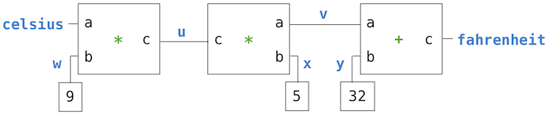

##  Local State

Lists and dictionaries have *local state*: they are changing values that have some particular contents at any point in the execution of a program. The word "state" implies an evolving process in which that state may change.

Functions can also have local state. For instance, let us define a function that models the process of withdrawing money from a bank account. We will create a function called `withdraw`, which takes as its argument an amount to be withdrawn. If there is enough money in the account to accommodate the withdrawal, then `withdraw` will return the balance remaining after the withdrawal. Otherwise, `withdraw` will return the message `'Insufficient funds'`. For example, if we begin with $100 in the account, we would like to obtain the following sequence of return values by calling withdraw:

```python
>>> withdraw(25)
75
>>> withdraw(25)
50
>>> withdraw(60)
'Insufficient funds'
>>> withdraw(15)
35
```

Above, the expression `withdraw(25)`, evaluated twice, yields different values. Thus, this user-defined function is non-pure. Calling the function not only returns a value, but also has the side effect of changing the function in some way, so that the next call with the same argument will return a different result. This side effect is a result of `withdraw` making a change to a name-value binding outside of the current frame.

For `withdraw` to make sense, it must be created with an initial account balance. The function `make_withdraw` is a higher-order function that takes a starting balance as an argument. The function `withdraw` is its return value.

```python
>>> withdraw = make_withdraw(100)
```

An implementation of `make_withdraw` requires a new kind of statement: a `nonlocal` statement. When we call `make_withdraw`, we bind the name `balance` to the initial amount. We then define and return a local function, `withdraw`, which updates and returns the value of `balance` when called.

```python
>>> def make_withdraw(balance):
        """Return a withdraw function that draws down balance with each call."""
        def withdraw(amount):
            nonlocal balance                 # Declare the name "balance" nonlocal
            if amount > balance:
                return 'Insufficient funds'
            balance = balance - amount       # Re-bind the existing balance name
            return balance
        return withdraw
```

The `nonlocal` statement declares that whenever we change the binding of the name `balance`, the binding is changed in the first frame in which `balance` is already bound. Recall that without the `nonlocal` statement, an assignment statement would always bind a name in the first frame of the current environment. The `nonlocal` statement indicates that the name appears somewhere in the environment other than the first (local) frame or the last (global) frame.

The following environment diagrams illustrate the effects of multiple calls to a function created by `make_withdraw`.

<iframe width="100%" height="500" frameborder="0" src="https://pythontutor.com/iframe-embed.html#code=def%20make_withdraw%28balance%29%3A%0A%20%20%20%20def%20withdraw%28amount%29%3A%0A%20%20%20%20%20%20%20%20nonlocal%20balance%0A%20%20%20%20%20%20%20%20if%20amount%20%3E%20balance%3A%0A%20%20%20%20%20%20%20%20%20%20%20%20return%20'Insufficient%20funds'%0A%20%20%20%20%20%20%20%20balance%20%3D%20balance%20-%20amount%0A%20%20%20%20%20%20%20%20return%20balance%0A%20%20%20%20return%20withdraw%0A%0Awd%20%3D%20make_withdraw%2820%29%0Awd%285%29%0Awd%283%29&amp;codeDivHeight=400&amp;codeDivWidth=350&amp;cumulative=false&amp;curInstr=0&amp;heapPrimitives=nevernest&amp;origin=opt-frontend.js&amp;py=3&amp;rawInputLstJSON=%5B%5D&amp;textReferences=false" ></iframe>

The first def statement has the usual effect: it creates a new user-defined function and binds the name `make_withdraw` to that function in the global frame. The subsequent call to `make_withdraw` creates and returns a locally defined function `withdraw`. The name `balance` is bound in the parent frame of this function. Crucially, there will only be this single binding for the name `balance` throughout the rest of this example.

Next, we evaluate an expression that calls this function, bound to the name `wd`, on an amount 5. The body of `withdraw` is executed in a new environment that extends the environment in which `withdraw` was defined. Tracing the effect of evaluating `withdraw` illustrates the effect of a `nonlocal` statement in Python: a name outside of the first local frame can be changed by an assignment statement.

<iframe width="100%" height="500" frameborder="0" src="https://pythontutor.com/iframe-embed.html#code=def%20make_withdraw%28balance%29%3A%0A%20%20%20%20def%20withdraw%28amount%29%3A%0A%20%20%20%20%20%20%20%20nonlocal%20balance%0A%20%20%20%20%20%20%20%20if%20amount%20%3E%20balance%3A%0A%20%20%20%20%20%20%20%20%20%20%20%20return%20'Insufficient%20funds'%0A%20%20%20%20%20%20%20%20balance%20%3D%20balance%20-%20amount%0A%20%20%20%20%20%20%20%20return%20balance%0A%20%20%20%20return%20withdraw%0A%0Awd%20%3D%20make_withdraw%2820%29%0Awd%285%29%0Awd%283%29&amp;codeDivHeight=400&amp;codeDivWidth=350&amp;cumulative=false&amp;curInstr=0&amp;heapPrimitives=nevernest&amp;origin=opt-frontend.js&amp;py=3&amp;rawInputLstJSON=%5B%5D&amp;textReferences=false" ></iframe>

The `nonlocal` statement changes all of the remaining assignment statements in the definition of `withdraw`. After executing `nonlocal balance`, any assignment statement with `balance` on the left-hand side of `=` will not bind `balance` in the first frame of the current environment. Instead, it will find the first frame in which `balance` was already defined and re-bind the name in that frame. If `balance` has not previously been bound to a value, then the `nonlocal` statement will give an error.

By virtue of changing the binding for `balance`, we have changed the `withdraw` function as well. The next time it is called, the name `balance` will evaluate to 15 instead of 20. Hence, when we call `withdraw` a second time, we see that its return value is 12 and not 17. The change to `balance` from the first call affects the result of the second call.

<iframe width="100%" height="500" frameborder="0" src="https://pythontutor.com/iframe-embed.html#code=def%20make_withdraw%28balance%29%3A%0A%20%20%20%20def%20withdraw%28amount%29%3A%0A%20%20%20%20%20%20%20%20nonlocal%20balance%0A%20%20%20%20%20%20%20%20if%20amount%20%3E%20balance%3A%0A%20%20%20%20%20%20%20%20%20%20%20%20return%20'Insufficient%20funds'%0A%20%20%20%20%20%20%20%20balance%20%3D%20balance%20-%20amount%0A%20%20%20%20%20%20%20%20return%20balance%0A%20%20%20%20return%20withdraw%0A%0Awd%20%3D%20make_withdraw%2820%29%0Awd%285%29%0Awd%283%29&amp;codeDivHeight=400&amp;codeDivWidth=350&amp;cumulative=false&amp;curInstr=0&amp;heapPrimitives=nevernest&amp;origin=opt-frontend.js&amp;py=3&amp;rawInputLstJSON=%5B%5D&amp;textReferences=false" ></iframe>

The second call to `withdraw` does create a second local frame, as usual. However, both `withdraw` frames have the same parent. That is, they both extend the environment for `make_withdraw`, which contains the binding for `balance`. Hence, they share that particular name binding. Calling `withdraw` has the side effect of altering the environment that will be extended by future calls to `withdraw`. The `nonlocal` statement allows `withdraw` to change a name binding in the `make_withdraw` frame.

Ever since we first encountered nested `def` statements, we have observed that a locally defined function can look up names outside of its local frames. No `nonlocal` statement is required to *access* a non-local name. By contrast, only after a `nonlocal` statement can a function *change* the binding of names in these frames.

By introducing `nonlocal` statements, we have created a dual role for assignment statements. Either they change local bindings, or they change nonlocal bindings. In fact, assignment statements already had a dual role: they either created new bindings or re-bound existing names. Assignment can also change the contents of lists and dictionaries. The many roles of Python assignment can obscure the effects of executing an assignment statement. It is up to you as a programmer to document your code clearly so that the effects of assignment can be understood by others.

**Python Particulars.** This pattern of non-local assignment is a general feature of programming languages with higher-order functions and lexical scope. Most other languages do not require a `nonlocal` statement at all. Instead, non-local assignment is often the default behavior of assignment statements.

Python also has an unusual restriction regarding the lookup of names: within the body of a function, all instances of a name must refer to the same frame. As a result, Python cannot look up the value of a name in a non-local frame, then bind that same name in the local frame, because the same name would be accessed in two different frames in the same function. This restriction allows Python to pre-compute which frame contains each name before executing the body of a function. When this restriction is violated, a confusing error message results. To demonstrate, the `make_withdraw` example is repeated below with the `nonlocal` statement removed.

<iframe width="100%" height="500" frameborder="0" src="https://pythontutor.com/iframe-embed.html#code=def%20make_withdraw%28balance%29%3A%0A%20%20%20%20def%20withdraw%28amount%29%3A%0A%20%20%20%20%20%20%20%20if%20amount%20%3E%20balance%3A%0A%20%20%20%20%20%20%20%20%20%20%20%20return%20'Insufficient%20funds'%0A%20%20%20%20%20%20%20%20balance%20%3D%20balance%20-%20amount%0A%20%20%20%20%20%20%20%20return%20balance%0A%20%20%20%20return%20withdraw%0A%0Awd%20%3D%20make_withdraw%2820%29%0Awd%285%29&amp;codeDivHeight=400&amp;codeDivWidth=350&amp;cumulative=false&amp;curInstr=0&amp;heapPrimitives=nevernest&amp;origin=opt-frontend.js&amp;py=3&amp;rawInputLstJSON=%5B%5D&amp;textReferences=false" ></iframe>

This `UnboundLocalError` appears because `balance` is assigned locally in line 5, and so Python assumes that all references to `balance` must appear in the local frame as well. This error occurs *before* line 5 is ever executed, implying that Python has considered line 5 in some way before executing line 3. As we study interpreter design, we will see that pre-computing facts about a function body before executing it is quite common. In this case, Python's pre-processing restricted the frame in which `balance` could appear, and thus prevented the name from being found. Adding a `nonlocal` statement corrects this error. The `nonlocal` statement did not exist in Python 2.

## The Benefits of Non-Local Assignment

Non-local assignment is an important step on our path to viewing a program as a collection of independent and autonomous *objects*, which interact with each other but each manage their own internal state.

In particular, non-local assignment has given us the ability to maintain some state that is local to a function, but evolves over successive calls to that function. The `balance` associated with a particular withdraw function is shared among all calls to that function. However, the binding for balance associated with an instance of withdraw is inaccessible to the rest of the program. Only `wd` is associated with the frame for `make_withdraw` in which it was defined. If `make_withdraw` is called again, then it will create a separate frame with a separate binding for `balance`.

We can extend our example to illustrate this point. A second call to `make_withdraw` returns a second `withdraw` function that has a different parent. We bind this second function to the name `wd2` in the global frame.

<iframe width="100%" height="500" frameborder="0" src="https://pythontutor.com/iframe-embed.html#code=def%20make_withdraw%28balance%29%3A%0A%20%20%20%20def%20withdraw%28amount%29%3A%0A%20%20%20%20%20%20%20%20nonlocal%20balance%0A%20%20%20%20%20%20%20%20if%20amount%20%3E%20balance%3A%0A%20%20%20%20%20%20%20%20%20%20%20%20return%20'Insufficient%20funds'%0A%20%20%20%20%20%20%20%20balance%20%3D%20balance%20-%20amount%0A%20%20%20%20%20%20%20%20return%20balance%0A%20%20%20%20return%20withdraw%0A%0Awd%20%3D%20make_withdraw%2820%29%0Awd2%20%3D%20make_withdraw%287%29%0Awd2%286%29%0Awd%288%29&amp;codeDivHeight=400&amp;codeDivWidth=350&amp;cumulative=false&amp;curInstr=0&amp;heapPrimitives=nevernest&amp;origin=opt-frontend.js&amp;py=3&amp;rawInputLstJSON=%5B%5D&amp;textReferences=false" ></iframe>

Now, we see that there are in fact two bindings for the name `balance` in two different frames, and each `withdraw` function has a different parent. The name `wd` is bound to a function with a balance of 20, while `wd2` is bound to a different function with a balance of 7.

Calling `wd2` changes the binding of its non-local `balance` name, but does not affect the function bound to the name `withdraw`. A future call to `wd` is unaffected by the changing balance of `wd2`; its balance is still 20.

<iframe width="100%" height="500" frameborder="0" src="https://pythontutor.com/iframe-embed.html#code=def%20make_withdraw%28balance%29%3A%0A%20%20%20%20def%20withdraw%28amount%29%3A%0A%20%20%20%20%20%20%20%20nonlocal%20balance%0A%20%20%20%20%20%20%20%20if%20amount%20%3E%20balance%3A%0A%20%20%20%20%20%20%20%20%20%20%20%20return%20'Insufficient%20funds'%0A%20%20%20%20%20%20%20%20balance%20%3D%20balance%20-%20amount%0A%20%20%20%20%20%20%20%20return%20balance%0A%20%20%20%20return%20withdraw%0A%0Awd%20%3D%20make_withdraw%2820%29%0Awd2%20%3D%20make_withdraw%287%29%0Awd2%286%29%0Awd%288%29&amp;codeDivHeight=400&amp;codeDivWidth=350&amp;cumulative=false&amp;curInstr=0&amp;heapPrimitives=nevernest&amp;origin=opt-frontend.js&amp;py=3&amp;rawInputLstJSON=%5B%5D&amp;textReferences=false" ></iframe>

In this way, each instance of `withdraw` maintains its own balance state, but that state is inaccessible to any other function in the program. Viewing this situation at a higher level, we have created an abstraction of a bank account that manages its own internals but behaves in a way that models accounts in the world: it changes over time based on its own history of withdrawal requests.

## The Cost of Non-Local Assignment

Our environment model of computation cleanly extends to explain the effects of non-local assignment. However, non-local assignment introduces some important nuances in the way we think about names and values.

Previously, our values did not change; only our names and bindings changed. When two names `a` and `b` were both bound to the value 4, it did not matter whether they were bound to the same 4 or different 4's. As far as we could tell, there was only one 4 object that never changed.

However, functions with state do not behave this way. When two names `wd` and `wd2` are both bound to a `withdraw` function, it *does* matter whether they are bound to the same function or different instances of that function. Consider the following example, which contrasts the one we just analyzed. In this case, calling the function named by `wd2` did change the value of the function named by `wd`, because both names refer to the same function.

<iframe width="100%" height="500" frameborder="0" src="https://pythontutor.com/iframe-embed.html#code=def%20make_withdraw%28balance%29%3A%0A%20%20%20%20def%20withdraw%28amount%29%3A%0A%20%20%20%20%20%20%20%20nonlocal%20balance%0A%20%20%20%20%20%20%20%20if%20amount%20%3E%20balance%3A%0A%20%20%20%20%20%20%20%20%20%20%20%20return%20'Insufficient%20funds'%0A%20%20%20%20%20%20%20%20balance%20%3D%20balance%20-%20amount%0A%20%20%20%20%20%20%20%20return%20balance%0A%20%20%20%20return%20withdraw%0A%0Awd%20%3D%20make_withdraw%2812%29%0Awd2%20%3D%20wd%0Awd2%281%29%0Awd%281%29&amp;codeDivHeight=400&amp;codeDivWidth=350&amp;cumulative=false&amp;curInstr=0&amp;heapPrimitives=nevernest&amp;origin=opt-frontend.js&amp;py=3&amp;rawInputLstJSON=%5B%5D&amp;textReferences=false" ></iframe>

It is not unusual for two names to co-refer to the same value in the world, and so it is in our programs. But, as values change over time, we must be very careful to understand the effect of a change on other names that might refer to those values.

The key to correctly analyzing code with non-local assignment is to remember that only function calls can introduce new frames. Assignment statements always change bindings in existing frames. In this case, unless `make_withdraw` is called twice, there can be only one binding for `balance`.

**Sameness and change.** These subtleties arise because, by introducing non-pure functions that change the non-local environment, we have changed the nature of expressions. An expression that contains only pure function calls is *referentially transparent*; its value does not change if we substitute one of its subexpression with the value of that subexpression.

Re-binding operations violate the conditions of referential transparency because they do more than return a value; they change the environment. When we introduce arbitrary re-binding, we encounter a thorny epistemological issue: what it means for two values to be the same. In our environment model of computation, two separately defined functions are not the same, because changes to one may not be reflected in the other.

In general, so long as we never modify data objects, we can regard a compound data object to be precisely the totality of its pieces. For example, a rational number is determined by giving its numerator and its denominator. But this view is no longer valid in the presence of change, where a compound data object has an "identity" that is something different from the pieces of which it is composed. A bank account is still "the same" bank account even if we change the balance by making a withdrawal; conversely, we could have two bank accounts that happen to have the same balance, but are different objects.

Despite the complications it introduces, non-local assignment is a powerful tool for creating modular programs. Different parts of a program, which correspond to different environment frames, can evolve separately throughout program execution. Moreover, using functions with local state, we are able to implement mutable data types. In fact, we can implement abstract data types that are equivalent to the built-in `list` and `dict` types introduced above.

## Implementing Lists and Dictionaries

The Python language does not give us access to the implementation of lists, only to the sequence abstraction and mutation methods built into the language. To understand how a mutable list could be represented using functions with local state, we will now develop an implementation of a mutable linked list.

We will represent a mutable linked list by a function that has a linked list as its local state. Lists need to have an identity, like any mutable value. In particular, we cannot use `None` to represent an empty mutable list, because two empty lists are not identical values (e.g., appending to one does not append to the other), but `None is None`. On the other hand, two different functions that each have `empty` as their local state will suffice to distinguish two empty lists.

If a mutable linked list is a function, what arguments does it take? The answer exhibits a general pattern in programming: the function is a dispatch function and its arguments are first a message, followed by additional arguments to parameterize that method. This message is a string naming what the function should do. Dispatch functions are effectively many functions in one: the message determines the behavior of the function, and the additional arguments are used in that behavior.

Our mutable list will respond to five different messages: `len`, `getitem`, `push_first`, `pop_first`, and `str`. The first two implement the behaviors of the sequence abstraction. The next two add or remove the first element of the list. The final message returns a string representation of the whole linked list.

```python
>>> def mutable_link():
        """Return a functional implementation of a mutable linked list."""
        contents = empty
        def dispatch(message, value=None):
            nonlocal contents
            if message == 'len':
                return len_link(contents)
            elif message == 'getitem':
                return getitem_link(contents, value)
            elif message == 'push_first':
                contents = link(value, contents)
            elif message == 'pop_first':
                f = first(contents)
                contents = rest(contents)
                return f
            elif message == 'str':
                return join_link(contents, ", ")
        return dispatch
```

We can also add a convenience function to construct a functionally implemented linked list from any built-in sequence, simply by adding each element in reverse order.

```python
>>> def to_mutable_link(source):
        """Return a functional list with the same contents as source."""
        s = mutable_link()
        for element in reversed(source):
            s('push_first', element)
        return s
```

In the definition above, the function `reversed` takes and returns an iterable value; it is another example of a function that processes sequences.

At this point, we can construct a functionally implemented mutable linked lists. Note that the linked list itself is a function.

```python
>>> s = to_mutable_link(suits)
>>> type(s)
<class 'function'>
>>> print(s('str'))
heart, diamond, spade, club
```

In addition, we can pass messages to the list `s` that change its contents, for instance removing the first element.

```python
>>> s('pop_first')
'heart'
>>> print(s('str'))
diamond, spade, club
```

In principle, the operations `push_first` and `pop_first` suffice to make arbitrary changes to a list. We can always empty out the list entirely and then replace its old contents with the desired result.

**Message passing.** Given some time, we could implement the many useful mutation operations of Python lists, such as `extend` and `insert`. We would have a choice: we could implement them all as functions, which use the existing messages `pop_first` and `push_first` to make all changes. Alternatively, we could add additional `elif` clauses to the body of `dispatch`, each checking for a message (e.g., `'extend'`) and applying the appropriate change to `contents` directly.

This second approach, which encapsulates the logic for all operations on a data value within one function that responds to different messages, is a discipline called message passing. A program that uses message passing defines dispatch functions, each of which may have local state, and organizes computation by passing "messages" as the first argument to those functions. The messages are strings that correspond to particular behaviors.

**Implementing Dictionaries.** We can also implement a value with similar behavior to a dictionary. In this case, we use a list of key-value pairs to store the contents of the dictionary. Each pair is a two-element list.

```python
>>> def dictionary():
        """Return a functional implementation of a dictionary."""
        records = []
        def getitem(key):
            matches = [r for r in records if r[0] == key]
            if len(matches) == 1:
                key, value = matches[0]
                return value
        def setitem(key, value):
            nonlocal records
            non_matches = [r for r in records if r[0] != key]
            records = non_matches + [[key, value]]
        def dispatch(message, key=None, value=None):
            if message == 'getitem':
                return getitem(key)
            elif message == 'setitem':
                setitem(key, value)
        return dispatch
```

Again, we use the message passing method to organize our implementation. We have supported two messages: `getitem` and `setitem`. To insert a value for a key, we filter out any existing records with the given key, then add one. In this way, we are assured that each key appears only once in records. To look up a value for a key, we filter for the record that matches the given key. We can now use our implementation to store and retrieve values.

```python
>>> d = dictionary()
>>> d('setitem', 3, 9)
>>> d('setitem', 4, 16)
>>> d('getitem', 3)
9
>>> d('getitem', 4)
16
```

This implementation of a dictionary is *not* optimized for fast record lookup, because each call must filter through all records. The built-in dictionary type is considerably more efficient. The way in which it is implemented is beyond the scope of this text.

## Dispatch Dictionaries

The dispatch function is a general method for implementing a message passing interface for abstract data. To implement message dispatch, we have thus far used conditional statements to compare the message string to a fixed set of known messages.

The built-in dictionary data type provides a general method for looking up a value for a key. Instead of using conditionals to implement dispatching, we can use dictionaries with string keys.

The mutable `account` data type below is implemented as a dictionary. It has a constructor `account` and selector `check_balance`, as well as functions to `deposit` or `withdraw` funds. Moreover, the local state of the account is stored in the dictionary alongside the functions that implement its behavior.

<iframe width="800" height="500" frameborder="0" src="https://pythontutor.com/iframe-embed.html#code=def%20account%28initial_balance%29%3A%0A%20%20%20%20def%20deposit%28amount%29%3A%0A%20%20%20%20%20%20%20%20dispatch%5B'balance'%5D%20%2B%3D%20amount%0A%20%20%20%20%20%20%20%20return%20dispatch%5B'balance'%5D%0A%20%20%20%20def%20withdraw%28amount%29%3A%0A%20%20%20%20%20%20%20%20if%20amount%20%3E%20dispatch%5B'balance'%5D%3A%0A%20%20%20%20%20%20%20%20%20%20%20%20return%20'Insufficient%20funds'%0A%20%20%20%20%20%20%20%20dispatch%5B'balance'%5D%20-%3D%20amount%0A%20%20%20%20%20%20%20%20return%20dispatch%5B'balance'%5D%0A%20%20%20%20dispatch%20%3D%20%7B'deposit'%3A%20%20%20deposit,%0A%20%20%20%20%20%20%20%20%20%20%20%20%20%20%20%20'withdraw'%3A%20%20withdraw,%0A%20%20%20%20%20%20%20%20%20%20%20%20%20%20%20%20'balance'%3A%20%20%20initial_balance%7D%0A%20%20%20%20return%20dispatch%0A%0Adef%20withdraw%28account,%20amount%29%3A%0A%20%20%20%20return%20account%5B'withdraw'%5D%28amount%29%0Adef%20deposit%28account,%20amount%29%3A%0A%20%20%20%20return%20account%5B'deposit'%5D%28amount%29%0Adef%20check_balance%28account%29%3A%0A%20%20%20%20return%20account%5B'balance'%5D%0A%0Aa%20%3D%20account%2820%29%0Adeposit%28a,%205%29%0Awithdraw%28a,%2017%29%0Acheck_balance%28a%29&codeDivHeight=400&codeDivWidth=350&cumulative=false&curInstr=0&heapPrimitives=nevernest&origin=opt-frontend.js&py=3&rawInputLstJSON=%5B%5D&textReferences=false"> </iframe>

The name `dispatch` within the body of the `account` constructor is bound to a dictionary that contains the messages accepted by an account as keys. The *balance* is a number, while the messages *deposit* and *withdraw* are bound to functions. These functions have access to the `dispatch` dictionary, and so they can read and change the balance. By storing the balance in the dispatch dictionary rather than in the `account` frame directly, we avoid the need for `nonlocal` statements in `deposit` and `withdraw`.

The operators `+=` and `-=` are shorthand in Python (and many other languages) for combined lookup and re-assignment. The last two lines below are equivalent.

```python
>>> a = 2
>>> a = a + 1
>>> a += 1
```

## Propagating Constraints

Mutable data allows us to simulate systems with change, but also allows us to build new kinds of abstractions. In this extended example, we combine nonlocal assignment, lists, and dictionaries to build a *constraint-based system* that supports computation in multiple directions. Expressing programs as constraints is a type of *declarative programming*, in which a programmer declares the structure of a problem to be solved, but abstracts away the details of exactly how the solution to the problem is computed.

Computer programs are traditionally organized as one-directional computations, which perform operations on pre-specified arguments to produce desired outputs. On the other hand, we often want to model systems in terms of relations among quantities. For example, we previously considered the ideal gas law, which relates the pressure (`p`), volume (`v`), quantity (`n`), and temperature (`t`) of an ideal gas via Boltzmann's constant (`k`):

```python
p * v = n * k * t
```

Such an equation is not one-directional. Given any four of the quantities, we can use this equation to compute the fifth. Yet translating the equation into a traditional computer language would force us to choose one of the quantities to be computed in terms of the other four. Thus, a function for computing the pressure could not be used to compute the temperature, even though the computations of both quantities arise from the same equation.

In this section, we sketch the design of a general model of linear relationships. We define primitive constraints that hold between quantities, such as an `adder(a, b, c)` constraint that enforces the mathematical relationship `a + b = c`.

We also define a means of combination, so that primitive constraints can be combined to express more complex relations. In this way, our program resembles a programming language. We combine constraints by constructing a network in which constraints are joined by connectors. A connector is an object that "holds" a value and may participate in one or more constraints.

For example, we know that the relationship between Fahrenheit and Celsius temperatures is:

```python
9 * c = 5 * (f - 32)
```

This equation is a complex constraint between `c` and `f`. Such a constraint can be thought of as a network consisting of primitive `adder`, `multiplier`, and `constant` constraints.



In this figure, we see on the left a multiplier box with three terminals, labeled `a`, `b`, and `c`. These connect the multiplier to the rest of the network as follows: The `a` terminal is linked to a connector `celsius`, which will hold the Celsius temperature. The `b` terminal is linked to a connector `w`, which is also linked to a constant box that holds 9. The `c` terminal, which the multiplier box constrains to be the product of `a` and `b`, is linked to the `c` terminal of another multiplier box, whose `b` is connected to a constant 5 and whose `a` is connected to one of the terms in the sum constraint.

Computation by such a network proceeds as follows: When a connector is given a value (by the user or by a constraint box to which it is linked), it awakens all of its associated constraints (except for the constraint that just awakened it) to inform them that it has a value. Each awakened constraint box then polls its connectors to see if there is enough information to determine a value for a connector. If so, the box sets that connector, which then awakens all of its associated constraints, and so on. For instance, in conversion between Celsius and Fahrenheit, `w`, `x`, and `y` are immediately set by the constant boxes to 9, 5, and 32, respectively. The connectors awaken the multipliers and the adder, which determine that there is not enough information to proceed. If the user (or some other part of the network) sets the `celsius` connector to a value (say 25), the leftmost multiplier will be awakened, and it will set `u` to `25 * 9 = 225`. Then `u` awakens the second multiplier, which sets `v` to 45, and `v` awakens the adder, which sets the `fahrenheit` connector to 77.

**Using the Constraint System.** To use the constraint system to carry out the temperature computation outlined above, we first create two named connectors, `celsius` and `fahrenheit`, by calling the `connector` constructor.

```python
>>> celsius = connector('Celsius')
>>> fahrenheit = connector('Fahrenheit')
```

Then, we link these connectors into a network that mirrors the figure above. The function `converter` assembles the various connectors and constraints in the network.

```python
>>> def converter(c, f):
        """Connect c to f with constraints to convert from Celsius to Fahrenheit."""
        u, v, w, x, y = [connector() for _ in range(5)]
        multiplier(c, w, u)
        multiplier(v, x, u)
        adder(v, y, f)
        constant(w, 9)
        constant(x, 5)
        constant(y, 32)
>>> converter(celsius, fahrenheit)
```

We will use a message passing system to coordinate constraints and connectors. Constraints are dictionaries that do not hold local states themselves. Their responses to messages are non-pure functions that change the connectors that they constrain.

Connectors are dictionaries that hold a current value and respond to messages that manipulate that value. Constraints will not change the value of connectors directly, but instead will do so by sending messages, so that the connector can notify other constraints in response to the change. In this way, a connector represents a number, but also encapsulates connector behavior.

One message we can send to a connector is to set its value. Here, we (the `'user'`) set the value of `celsius` to 25.

```python
>>> celsius['set_val']('user', 25)
Celsius = 25
Fahrenheit = 77.0
```

Not only does the value of `celsius` change to 25, but its value propagates through the network, and so the value of `fahrenheit` is changed as well. These changes are printed because we named these two connectors when we constructed them.

Now we can try to set `fahrenheit` to a new value, say 212.

```python
>>> fahrenheit['set_val']('user', 212)
Contradiction detected: 77.0 vs 212
```

The connector complains that it has sensed a contradiction: Its value is 77.0, and someone is trying to set it to 212. If we really want to reuse the network with new values, we can tell `celsius` to forget its old value:

```python
>>> celsius['forget']('user')
Celsius is forgotten
Fahrenheit is forgotten
```

The connector `celsius` finds that the `user`, who set its value originally, is now retracting that value, so `celsius` agrees to lose its value, and it informs the rest of the network of this fact. This information eventually propagates to `fahrenheit`, which now finds that it has no reason for continuing to believe that its own value is 77. Thus, it also gives up its value.

Now that `fahrenheit` has no value, we are free to set it to 212:

```python
>>> fahrenheit['set_val']('user', 212)
Fahrenheit = 212
Celsius = 100.0
```

This new value, when propagated through the network, forces `celsius` to have a value of 100. We have used the very same network to compute `celsius` given `fahrenheit` and to compute `fahrenheit` given `celsius`. This non-directionality of computation is the distinguishing feature of constraint-based systems.

**Implementing the Constraint System.** As we have seen, connectors are dictionaries that map message names to function and data values. We will implement connectors that respond to the following messages:

- `connector['set_val'](source, value)` indicates that the `source` is requesting the connector to set its current value to `value`.
- `connector['has_val']()` returns whether the connector already has a value.
- `connector['val']` is the current value of the connector.
- `connector['forget'](source)` tells the connector that the `source` is requesting it to forget its value.
- `connector['connect'](source)` tells the connector to participate in a new constraint, the `source`.

Constraints are also dictionaries, which receive information from connectors by means of two messages:

- `constraint['new_val']()` indicates that some connector that is connected to the constraint has a new value.
- `constraint['forget']()` indicates that some connector that is connected to the constraint has forgotten its value.

When constraints receive these messages, they propagate them appropriately to other connectors.

The `adder` function constructs an adder constraint over three connectors, where the first two must add to the third: `a + b = c`. To support multidirectional constraint propagation, the adder must also specify that it subtracts `a` from `c` to get `b` and likewise subtracts `b` from `c` to get `a`.

```python
>>> from operator import add, sub
>>> def adder(a, b, c):
        """The constraint that a + b = c."""
        return make_ternary_constraint(a, b, c, add, sub, sub)
```

We would like to implement a generic ternary (three-way) constraint, which uses the three connectors and three functions from `adder` to create a constraint that accepts `new_val` and `forget` messages. The response to messages are local functions, which are placed in a dictionary called `constraint`.

```python
>>> def make_ternary_constraint(a, b, c, ab, ca, cb):
        """The constraint that ab(a,b)=c and ca(c,a)=b and cb(c,b) = a."""
        def new_value():
            av, bv, cv = [connector['has_val']() for connector in (a, b, c)]
            if av and bv:
                c['set_val'](constraint, ab(a['val'], b['val']))
            elif av and cv:
                b['set_val'](constraint, ca(c['val'], a['val']))
            elif bv and cv:
                a['set_val'](constraint, cb(c['val'], b['val']))
        def forget_value():
            for connector in (a, b, c):
                connector['forget'](constraint)
        constraint = {'new_val': new_value, 'forget': forget_value}
        for connector in (a, b, c):
            connector['connect'](constraint)
        return constraint
```

The dictionary called `constraint` is a dispatch dictionary, but also the constraint object itself. It responds to the two messages that constraints receive, but is also passed as the `source` argument in calls to its connectors.

The constraint's local function `new_value` is called whenever the constraint is informed that one of its connectors has a value. This function first checks to see if both `a` and `b` have values. If so, it tells `c` to set its value to the return value of function `ab`, which is `add` in the case of an `adder`. The constraint passes *itself* (`constraint`) as the `source` argument of the connector, which is the adder object. If `a` and `b` do not both have values, then the constraint checks `a` and `c`, and so on.

If the constraint is informed that one of its connectors has forgotten its value, it requests that all of its connectors now forget their values. (Only those values that were set by this constraint are actually lost.)

A `multiplier` is very similar to an `adder`.

```python
>>> from operator import mul, truediv
>>> def multiplier(a, b, c):
        """The constraint that a * b = c."""
        return make_ternary_constraint(a, b, c, mul, truediv, truediv)
```

A constant is a constraint as well, but one that is never sent any messages, because it involves only a single connector that it sets on construction.

```python
>>> def constant(connector, value):
        """The constraint that connector = value."""
        constraint = {}
        connector['set_val'](constraint, value)
        return constraint
```

These three constraints are sufficient to implement our temperature conversion network.

**Representing connectors.** A connector is represented as a dictionary that contains a value, but also has response functions with local state. The connector must track the `informant` that gave it its current value, and a list of `constraints` in which it participates.

The constructor `connector` has local functions for setting and forgetting values, which are the responses to messages from constraints.

```python
>>> def connector(name=None):
        """A connector between constraints."""
        informant = None
        constraints = []
        def set_value(source, value):
            nonlocal informant
            val = connector['val']
            if val is None:
                informant, connector['val'] = source, value
                if name is not None:
                    print(name, '=', value)
                inform_all_except(source, 'new_val', constraints)
            else:
                if val != value:
                    print('Contradiction detected:', val, 'vs', value)
        def forget_value(source):
            nonlocal informant
            if informant == source:
                informant, connector['val'] = None, None
                if name is not None:
                    print(name, 'is forgotten')
                inform_all_except(source, 'forget', constraints)
        connector = {'val': None,
                     'set_val': set_value,
                     'forget': forget_value,
                     'has_val': lambda: connector['val'] is not None,
                     'connect': lambda source: constraints.append(source)}
        return connector
```

A connector is again a dispatch dictionary for the five messages used by constraints to communicate with connectors. Four responses are functions, and the final response is the value itself.

The local function `set_value` is called when there is a request to set the connector's value. If the connector does not currently have a value, it will set its value and remember as `informant` the source constraint that requested the value to be set. Then the connector will notify all of its participating constraints except the constraint that requested the value to be set. This is accomplished using the following iterative function.

```python
>>> def inform_all_except(source, message, constraints):
        """Inform all constraints of the message, except source."""
        for c in constraints:
            if c != source:
                c[message]()
```

If a connector is asked to forget its value, it calls the local function `forget-value`, which first checks to make sure that the request is coming from the same constraint that set the value originally. If so, the connector informs its associated constraints about the loss of the value.

The response to the message `has_val` indicates whether the connector has a value. The response to the message `connect` adds the source constraint to the list of constraints.

The constraint program we have designed introduces many ideas that will appear again in object-oriented programming. Constraints and connectors are both abstractions that are manipulated through messages. When the value of a connector is changed, it is changed via a message that not only changes the value, but validates it (checking the source) and propagates its effects (informing other constraints). In fact, we will use a similar architecture of dictionaries with string-valued keys and functional values to implement an object-oriented system later in this chapter.

## Object-Oriented Programming

Object-oriented programming (OOP) is a method for organizing programs that brings together many of the ideas introduced in this chapter. Like the functions in data abstraction, classes create abstraction barriers between the use and implementation of data. Like dispatch dictionaries, objects respond to behavioral requests. Like mutable data structures, objects have local state that is not directly accessible from the global environment. The Python object system provides convenient syntax to promote the use of these techniques for organizing programs. Much of this syntax is shared among other object-oriented programming languages.

The object system offers more than just convenience. It enables a new metaphor for designing programs in which several independent agents interact within the computer. Each object bundles together local state and behavior in a way that abstracts the complexity of both. Objects communicate with each other, and useful results are computed as a consequence of their interaction. Not only do objects pass messages, they also share behavior among other objects of the same type and inherit characteristics from related types.

The paradigm of object-oriented programming has its own vocabulary that supports the object metaphor. We have seen that an object is a data value that has methods and attributes, accessible via dot notation. Every object also has a type, called its *class*. To create new types of data, we implement new classes.

## Objects and Classes

A class serves as a template for all objects whose type is that class. Every object is an instance of some particular class. The objects we have used so far all have built-in classes, but new user-defined classes can be created as well. A class definition specifies the attributes and methods shared among objects of that class. We will introduce the class statement by revisiting the example of a bank account.

When introducing local state, we saw that bank accounts are naturally modeled as mutable values that have a `balance`. A bank account object should have a `withdraw` method that updates the account balance and returns the requested amount, if it is available. To complete the abstraction: a bank account should be able to return its current `balance`, return the name of the account `holder`, and an amount for `deposit`.

An `Account` class allows us to create multiple instances of bank accounts. The act of creating a new object instance is known as *instantiating* the class. The syntax in Python for instantiating a class is identical to the syntax of calling a function. In this case, we call `Account` with the argument `'Kirk'`, the account holder's name.

```python
>>> a = Account('Kirk')
```

An *attribute* of an object is a name-value pair associated with the object, which is accessible via dot notation. The attributes specific to a particular object, as opposed to all objects of a class, are called *instance attributes*. Each `Account` has its own balance and account holder name, which are examples of instance attributes. In the broader programming community, instance attributes may also be called *fields*, *properties*, or *instance variables*.

```python
>>> a.holder
'Kirk'
>>> a.balance
0
```

Functions that operate on the object or perform object-specific computations are called methods. The return values and side effects of a method can depend upon and change other attributes of the object. For example, `deposit` is a method of our `Account` object `a`. It takes one argument, the amount to deposit, changes the `balance` attribute of the object, and returns the resulting balance.

```python
>>> a.deposit(15)
15
```

We say that methods are *invoked* on a particular object. As a result of invoking the `withdraw` method, either the withdrawal is approved and the amount is deducted, or the request is declined and the method returns an error message.

```python
>>> a.withdraw(10)  # The withdraw method returns the balance after withdrawal
5
>>> a.balance       # The balance attribute has changed
5
>>> a.withdraw(10)
'Insufficient funds'
```

As illustrated above, the behavior of a method can depend upon the changing attributes of the object. Two calls to `withdraw` with the same argument return different results.

## Defining Classes

User-defined classes are created by `class` statements, which consist of a single clause. A class statement defines the class name, then includes a suite of statements to define the attributes of the class:

```python
class <name>:
    <suite>
```

When a class statement is executed, a new class is created and bound to `<name>` in the first frame of the current environment. The suite is then executed. Any names bound within the `<suite>` of a `class` statement, through `def` or assignment statements, create or modify attributes of the class.

Classes are typically organized around manipulating instance attributes, which are the name-value pairs associated with each instance of that class. The class specifies the instance attributes of its objects by defining a method for initializing new objects. For example, part of initializing an object of the `Account` class is to assign it a starting balance of 0.

The `<suite>` of a `class` statement contains `def` statements that define new methods for objects of that class. The method that initializes objects has a special name in Python, `__init__` (two underscores on each side of the word "init"), and is called the *constructor* for the class.

```python
>>> class Account:
        def __init__(self, account_holder):
            self.balance = 0
            self.holder = account_holder
```

The `__init__` method for `Account` has two formal parameters. The first one, `self`, is bound to the newly created `Account` object. The second parameter, `account_holder`, is bound to the argument passed to the class when it is called to be instantiated.

The constructor binds the instance attribute name `balance` to 0. It also binds the attribute name `holder` to the value of the name `account_holder`. The formal parameter `account_holder` is a local name in the `__init__` method. On the other hand, the name `holder` that is bound via the final assignment statement persists, because it is stored as an attribute of `self` using dot notation.

Having defined the `Account` class, we can instantiate it.

```python
>>> a = Account('Kirk')
```

This "call" to the `Account` class creates a new object that is an instance of `Account`, then calls the constructor function `__init__` with two arguments: the newly created object and the string `'Kirk'`. By convention, we use the parameter name `self` for the first argument of a constructor, because it is bound to the object being instantiated. This convention is adopted in virtually all Python code.

Now, we can access the object's `balance` and `holder` using dot notation.

```python
>>> a.balance
0
>>> a.holder
'Kirk'
```

**Identity.** Each new account instance has its own balance attribute, the value of which is independent of other objects of the same class.

```python
>>> b = Account('Spock')
>>> b.balance = 200
>>> [acc.balance for acc in (a, b)]
[0, 200]
```

To enforce this separation, every object that is an instance of a user-defined class has a unique identity. Object identity is compared using the `is` and `is not` operators.

```python
>>> a is a
True
>>> a is not b
True
```

Despite being constructed from identical calls, the objects bound to `a` and `b` are not the same. As usual, binding an object to a new name using assignment does not create a new object.

```python
>>> c = a
>>> c is a
True
```

New objects that have user-defined classes are only created when a class (such as `Account`) is instantiated with call expression syntax.

**Methods.** Object methods are also defined by a `def` statement in the suite of a `class` statement. Below, `deposit` and `withdraw` are both defined as methods on objects of the `Account` class.

```python
>>> class Account:
        def __init__(self, account_holder):
            self.balance = 0
            self.holder = account_holder
        def deposit(self, amount):
            self.balance = self.balance + amount
            return self.balance
        def withdraw(self, amount):
            if amount > self.balance:
                return 'Insufficient funds'
            self.balance = self.balance - amount
            return self.balance
```

While method definitions do not differ from function definitions in how they are declared, method definitions do have a different effect when executed. The function value that is created by a `def` statement within a `class` statement is bound to the declared name, but bound locally within the class as an attribute. That value is invoked as a method using dot notation from an instance of the class.

Each method definition again includes a special first parameter `self`, which is bound to the object on which the method is invoked. For example, let us say that `deposit` is invoked on a particular `Account` object and passed a single argument value: the amount deposited. The object itself is bound to `self`, while the argument is bound to `amount`. All invoked methods have access to the object via the `self` parameter, and so they can all access and manipulate the object's state.

To invoke these methods, we again use dot notation, as illustrated below.

```python
>>> spock_account = Account('Spock')
>>> spock_account.deposit(100)
100
>>> spock_account.withdraw(90)
10
>>> spock_account.withdraw(90)
'Insufficient funds'
>>> spock_account.holder
'Spock'
```

When a method is invoked via dot notation, the object itself (bound to `spock_account`, in this case) plays a dual role. First, it determines what the name `withdraw` means; `withdraw` is not a name in the environment, but instead a name that is local to the `Account` class. Second, it is bound to the first parameter `self` when the `withdraw` method is invoked.

## Message Passing and Dot Expressions

Methods, which are defined in classes, and instance attributes, which are typically assigned in constructors, are the fundamental elements of object-oriented programming. These two concepts replicate much of the behavior of a dispatch dictionary in a message passing implementation of a data value. Objects take messages using dot notation, but instead of those messages being arbitrary string-valued keys, they are names local to a class. Objects also have named local state values (the instance attributes), but that state can be accessed and manipulated using dot notation, without having to employ `nonlocal` statements in the implementation.

The central idea in message passing was that data values should have behavior by responding to messages that are relevant to the abstract type they represent. Dot notation is a syntactic feature of Python that formalizes the message passing metaphor. The advantage of using a language with a built-in object system is that message passing can interact seamlessly with other language features, such as assignment statements. We do not require different messages to "get" or "set" the value associated with a local attribute name; the language syntax allows us to use the message name directly.

**Dot expressions.** The code fragment `spock_account.deposit` is called a *dot expression*. A dot expression consists of an expression, a dot, and a name:

```python
<expression> . <name>
```

The `<expression>` can be any valid Python expression, but the `<name>` must be a simple name (not an expression that evaluates to a name). A dot expression evaluates to the value of the attribute with the given `<name>`, for the object that is the value of the `<expression>`.

The built-in function `getattr` also returns an attribute for an object by name. It is the function equivalent of dot notation. Using `getattr`, we can look up an attribute using a string, just as we did with a dispatch dictionary.

```python
>>> getattr(spock_account, 'balance')
10
```

We can also test whether an object has a named attribute with `hasattr`.

```python
>>> hasattr(spock_account, 'deposit')
True
```

The attributes of an object include all of its instance attributes, along with all of the attributes (including methods) defined in its class. Methods are attributes of the class that require special handling.

**Methods and functions.** When a method is invoked on an object, that object is implicitly passed as the first argument to the method. That is, the object that is the value of the `<expression>` to the left of the dot is passed automatically as the first argument to the method named on the right side of the dot expression. As a result, the object is bound to the parameter `self`.

To achieve automatic `self` binding, Python distinguishes between *functions*, which we have been creating since the beginning of the text, and *bound methods*, which couple together a function and the object on which that method will be invoked. A bound method value is already associated with its first argument, the instance on which it was invoked, which will be named `self` when the method is called.

We can see the difference in the interactive interpreter by calling `type` on the returned values of dot expressions. As an attribute of a class, a method is just a function, but as an attribute of an instance, it is a bound method:

```python
>>> type(Account.deposit)
<class 'function'>
>>> type(spock_account.deposit)
<class 'method'>
```

These two results differ only in the fact that the first is a standard two-argument function with parameters `self` and `amount`. The second is a one-argument method, where the name `self` will be bound to the object named `spock_account` automatically when the method is called, while the parameter `amount` will be bound to the argument passed to the method. Both of these values, whether function values or bound method values, are associated with the same `deposit` function body.

We can call `deposit` in two ways: as a function and as a bound method. In the former case, we must supply an argument for the `self` parameter explicitly. In the latter case, the `self` parameter is bound automatically.

```python
>>> Account.deposit(spock_account, 1001)  # The deposit function takes 2 arguments
1011
>>> spock_account.deposit(1000)           # The deposit method takes 1 argument
2011
```

The function `getattr` behaves exactly like dot notation: if its first argument is an object but the name is a method defined in the class, then `getattr` returns a bound method value. On the other hand, if the first argument is a class, then `getattr` returns the attribute value directly, which is a plain function.

**Naming Conventions.** Class names are conventionally written using the CapWords convention (also called CamelCase because the capital letters in the middle of a name look like humps). Method names follow the standard convention of naming functions using lowercased words separated by underscores.

In some cases, there are instance variables and methods that are related to the maintenance and consistency of an object that we don't want users of the object to see or use. They are not part of the abstraction defined by a class, but instead part of the implementation. Python's convention dictates that if an attribute name starts with an underscore, it should only be accessed within methods of the class itself, rather than by users of the class.

## Class Attributes

Some attribute values are shared across all objects of a given class. Such attributes are associated with the class itself, rather than any individual instance of the class. For instance, let us say that a bank pays interest on the balance of accounts at a fixed interest rate. That interest rate may change, but it is a single value shared across all accounts.

Class attributes are created by assignment statements in the suite of a `class` statement, outside of any method definition. In the broader developer community, class attributes may also be called class variables or static variables. The following class statement creates a class attribute for `Account` with the name `interest`.

```python
>>> class Account:
        interest = 0.02            # A class attribute
        def __init__(self, account_holder):
            self.balance = 0
            self.holder = account_holder
        # Additional methods would be defined here
```

This attribute can still be accessed from any instance of the class.

```python
>>> spock_account = Account('Spock')
>>> kirk_account = Account('Kirk')
>>> spock_account.interest
0.02
>>> kirk_account.interest
0.02
```

However, a single assignment statement to a class attribute changes the value of the attribute for all instances of the class.

```python
>>> Account.interest = 0.04
>>> spock_account.interest
0.04
>>> kirk_account.interest
0.04
```

**Attribute names.** We have introduced enough complexity into our object system that we have to specify how names are resolved to particular attributes. After all, we could easily have a class attribute and an instance attribute with the same name.

As we have seen, a dot expression consists of an expression, a dot, and a name:

```python
<expression> . <name>
```

To evaluate a dot expression:

1. Evaluate the `<expression>` to the left of the dot, which yields the *object* of the dot expression.
2. `<name>` is matched against the instance attributes of that object; if an attribute with that name exists, its value is returned.
3. If `<name>` does not appear among instance attributes, then `<name>` is looked up in the class, which yields a class attribute value.
4. That value is returned unless it is a function, in which case a bound method is returned instead.

In this evaluation procedure, instance attributes are found before class attributes, just as local names have priority over global in an environment. Methods defined within the class are combined with the object of the dot expression to form a bound method during the fourth step of this evaluation procedure. The procedure for looking up a name in a class has additional nuances that will arise shortly, once we introduce class inheritance.

**Attribute assignment.** All assignment statements that contain a dot expression on their left-hand side affect attributes for the object of that dot expression. If the object is an instance, then assignment sets an instance attribute. If the object is a class, then assignment sets a class attribute. As a consequence of this rule, assignment to an attribute of an object cannot affect the attributes of its class. The examples below illustrate this distinction.

If we assign to the named attribute `interest` of an account instance, we create a new instance attribute that has the same name as the existing class attribute.

```python
>>> kirk_account.interest = 0.08
```

and that attribute value will be returned from a dot expression.

```python
>>> kirk_account.interest
0.08
```

However, the class attribute `interest` still retains its original value, which is returned for all other accounts.

```python
>>> spock_account.interest
0.04
```

Changes to the class attribute `interest` will affect `spock_account`, but the instance attribute for `kirk_account` will be unaffected.

```python
>>> Account.interest = 0.05  # changing the class attribute
>>> spock_account.interest     # changes instances without like-named instance attributes
0.05
>>> kirk_account.interest     # but the existing instance attribute is unaffected
0.08
```