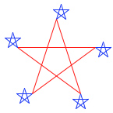

## Interpreting Computer Programs

## Introduction

Chapters 1 and 2 describe the close connection between two fundamental elements of programming: functions and data. We saw how functions can be manipulated as data using higher-order functions. We also saw how data can be endowed with behavior using message passing and an object system. We have also studied techniques for organizing large programs, such as functional abstraction, data abstraction, class inheritance, and generic functions. These core concepts constitute a strong foundation upon which to build modular, maintainable, and extensible programs.

This chapter focuses on the third fundamental element of programming: programs themselves. A Python program is just a collection of text. Only through the process of interpretation do we perform any meaningful computation based on that text. A programming language like Python is useful because we can define an *interpreter*, a program that carries out Python's evaluation and execution procedures. It is no exaggeration to regard this as the most fundamental idea in programming, that an interpreter, which determines the meaning of expressions in a programming language, is just another program.

To appreciate this point is to change our images of ourselves as programmers. We come to see ourselves as designers of languages, rather than only users of languages designed by others.

###  Programming Languages

Programming languages vary widely in their syntactic structures, features, and domain of application. Among general purpose programming languages, the constructs of function definition and function application are pervasive. On the other hand, powerful languages exist that do not include an object system, higher-order functions, assignment, or even control constructs such as `while` and `for` statements. As an example of a powerful language with a minimal set of features, we will introduce the [Scheme](https://en.wikipedia.org/wiki/Scheme_(programming_language)) programming language. The subset of Scheme introduced in this text does not allow mutable values at all.

In this chapter, we study the design of interpreters and the computational processes that they create when executing programs. The prospect of designing an interpreter for a general programming language may seem daunting. After all, interpreters are programs that can carry out any possible computation, depending on their input. However, many interpreters have an elegant common structure: two mutually recursive functions. The first evaluates expressions in environments; the second applies functions to arguments.

These functions are recursive in that they are defined in terms of each other: applying a function requires evaluating the expressions in its body, while evaluating an expression may involve applying one or more functions.

## Functional Programming

The software running on any modern computer is written in a variety of programming languages. There are physical languages, such as the machine languages for particular computers. These languages are concerned with the representation of data and control in terms of individual bits of storage and primitive machine instructions. The machine-language programmer is concerned with using the given hardware to erect systems and utilities for the efficient implementation of resource-limited computations. High-level languages, erected on a machine-language substrate, hide concerns about the representation of data as collections of bits and the representation of programs as sequences of primitive instructions. These languages have means of combination and abstraction, such as function definition, that are appropriate to the larger-scale organization of software systems.

In this section, we introduce a high-level programming language that encourages a functional style. Our object of study, a subset of the Scheme language, employs a very similar model of computation to Python's, but uses only expressions (no statements), specializes in symbolic computation, and employs only immutable values.

Scheme is a dialect of [Lisp](http://en.wikipedia.org/wiki/Lisp_(programming_language)), the second-oldest programming language that is still widely used today (after [Fortran](http://en.wikipedia.org/wiki/Fortran)). The community of Lisp programmers has continued to thrive for decades, and new dialects of Lisp such as [Clojure](http://en.wikipedia.org/wiki/Clojure) have some of the fastest growing communities of developers of any modern programming language. To follow along with the examples in this text, you can [download a Scheme interpreter](http://inst.eecs.berkeley.edu/~scheme/).

###  Expressions

Scheme programs consist of expressions, which are either call expressions or special forms. A call expression consists of an operator expression followed by zero or more operand sub-expressions, as in Python. Both the operator and operand are contained within parentheses:

```scheme
(quotient 10 2)
```

5

Scheme exclusively uses prefix notation. Operators are often symbols, such as `+` and `*`. Call expressions can be nested, and they may span more than one line:

```scheme
(+ (* 3 5) (- 10 6))
```

19

```scheme
(+ (* 3
      (+ (* 2 4)
         (+ 3 5)))
   (+ (- 10 7)
      6))
```

57

As in Python, Scheme expressions may be primitives or combinations. Number literals are primitives, while call expressions are combined forms that include arbitrary sub-expressions. The evaluation procedure of call expressions matches that of Python: first the operator and operand expressions are evaluated, and then the function that is the value of the operator is applied to the arguments that are the values of the operands.

The `if` expression in Scheme is a *special form*, meaning that while it looks syntactically like a call expression, it has a different evaluation procedure. The general form of an `if` expression is:

```scheme
(if <predicate> <consequent> <alternative>)
```

To evaluate an `if` expression, the interpreter starts by evaluating the `<predicate>` part of the expression. If the `<predicate>` evaluates to a true value, the interpreter then evaluates the `<consequent>` and returns its value. Otherwise it evaluates the `<alternative>` and returns its value.

Numerical values can be compared using familiar comparison operators, but prefix notation is used in this case as well:

```scheme
(>= 2 1)
```

true

The boolean values `#t` (or `true`) and `#f` (or `false`) in Scheme can be combined with boolean special forms, which have evaluation procedures similar to those in Python.

> - `(and <e1> ... <en>)` The interpreter evaluates the expressions `<e>` one at a time, in left-to-right order. If any `<e>` evaluates to `false`, the value of the `and` expression is `false`, and the rest of the `<e>`'s are not evaluated. If all `<e>`'s evaluate to true values, the value of the `and` expression is the value of the last one.
> - `(or <e1> ... <en>)` The interpreter evaluates the expressions `<e>` one at a time, in left-to-right order. If any `<e>` evaluates to a true value, that value is returned as the value of the `or` expression, and the rest of the `<e>`'s are not evaluated. If all `<e>`'s evaluate to `false`, the value of the `or` expression is `false`.
> - `(not <e>)` The value of a not expression is `true` when the expression `<e>` evaluates to `false`, and `false` otherwise.

### Definitions

Values can be named using the `define` special form:

```scheme
(define pi 3.14)
(* pi 2)
```

6.28

New functions (called *procedures* in Scheme) can be defined using a second version of the `define` special form. For example, to define squaring, we write:

```scheme
(define (square x) (* x x))
```

The general form of a procedure definition is:

```scheme
(define (<name> <formal parameters>) <body>)
```

The `<name>` is a symbol to be associated with the procedure definition in the environment. The `<formal parameters>` are the names used within the body of the procedure to refer to the corresponding arguments of the procedure. The `<body>` is an expression that will yield the value of the procedure application when the formal parameters are replaced by the actual arguments to which the procedure is applied. The `<name>` and the `<formal parameters>` are grouped within parentheses, just as they would be in an actual call to the procedure being defined.

Having defined square, we can now use it in call expressions:

```scheme
(square 21)
```

441

```scheme
(square (+ 2 5))
```

49

```scheme
(square (square 3))
```

81

User-defined functions can take multiple arguments and include special forms:

```scheme
(define (average x y)
  (/ (+ x y) 2))
(average 1 3)
```

2

```scheme
(define (abs x)
    (if (< x 0)
        (- x)
        x))
(abs -3)
```

3

Scheme supports local definitions with the same lexical scoping rules as Python. Below, we define an iterative procedure for computing square roots using nested definitions and recursion:

```scheme
(define (sqrt x)
  (define (good-enough? guess)
    (< (abs (- (square guess) x)) ))
  (define (improve guess)
    (average guess (/ x guess)))
  (define (sqrt-iter guess)
    (if (good-enough? guess)
        guess
        (sqrt-iter (improve guess))))
  (sqrt-iter 1.0))
(sqrt 9)
```

8

Anonymous functions are created using the `lambda` special form. `Lambda` is used to create procedures in the same way as `define`, except that no name is specified for the procedure:

```scheme
(lambda (<formal-parameters>) <body>)
```

The resulting procedure is just as much a procedure as one that is created using `define`. The only difference is that it has not been associated with any name in the environment. In fact, the following expressions are equivalent:

```scheme
(define (plus4 x) (+ x 4))
(define plus4 (lambda (x) (+ x 4)))
```

Like any expression that has a procedure as its value, a lambda expression can be used as the operator in a call expression:

```scheme
((lambda (x y z) (+ x y (square z))) )
```

12

###  Compound values

Pairs are built into the Scheme language. For historical reasons, pairs are created with the `cons` built-in function, and the elements of a pair are accessed with `car` and `cdr`:

```scheme
(define x (cons 1 2))
x
```

(1 . 2)

```scheme
(car x)
```

1

```scheme
(cdr x)
```

2

Recursive lists are also built into the language, using pairs. A special value denoted `nil` or `'()` represents the empty list. A recursive list value is rendered by placing its elements within parentheses, separated by spaces:

```scheme
(cons 1
      (cons 2
            (cons 3
                  (cons 4 nil))))
```

( 4)

```scheme
(list  4)
```

( 4)

```scheme
(define one-through-four (list  4))
(car one-through-four)
```

1

```scheme
(cdr one-through-four)
```

()

```scheme
(car (cdr one-through-four))
```

2

```scheme
(cons 10 one-through-four)
```

(1 3 4)

```scheme
(cons 5 one-through-four)
```

( 3 4)

Whether a list is empty can be determined using the primitive `null?` predicate. Using it, we can define the standard sequence operations for computing `length` and selecting elements:

```scheme
(define (length items)
  (if (null? items)
      0
      (+ 1 (length (cdr items)))))
(define (getitem items n)
  (if (= n 0)
      (car items)
      (getitem (cdr items) (- n 1))))
(define squares (list  16 25))
(length squares)
```

5

```scheme
(getitem squares 3)
```

16

###  Symbolic Data

All the compound data objects we have used so far were constructed ultimately from numbers. One of Scheme's strengths is working with arbitrary symbols as data.

In order to manipulate symbols we need a new element in our language: the ability to *quote* a data object. Suppose we want to construct the list `(a b)`. We can't accomplish this with `(list a b)`, because this expression constructs a list of the values of `a` and `b` rather than the symbols themselves. In Scheme, we refer to the symbols `a` and `b` rather than their values by preceding them with a single quotation mark:

```scheme
(define a 1)
(define b 2)
(list a b)
```

(1 2)

```scheme
(list 'a 'b)
```

(a b)

```scheme
(list 'a b)
```

(a 2)

In Scheme, any expression that is not evaluated is said to be *quoted*. This notion of quotation is derived from a classic philosophical distinction between a thing, such as a dog, which runs around and barks, and the word "dog" that is a linguistic construct for designating such things. When we use "dog" in quotation marks, we do not refer to some dog in particular but instead to a word. In language, quotation allow us to talk about language itself, and so it is in Scheme:

```scheme
(list 'define 'list)
```

(define list)

Quotation also allows us to type in compound objects, using the conventional printed representation for lists:

```scheme
(car '(a b c))
```

a

```scheme
(cdr '(a b c))
```

(b c)

The full Scheme language contains additional features, such as mutation operations, vectors, and maps. However, the subset we have introduced so far provides a rich functional programming language capable of implementing many of the ideas we have discussed so far in this text.

###  Turtle graphics

The implementation of Scheme that serves as a companion to this text includes Turtle graphics, an illustrating environment developed as part of the Logo language (another Lisp dialect). This turtle begins in the center of a canvas, moves and turns based on procedures, and draws lines behind it as it moves. While the turtle was invented to engage children in the act of programming, it remains an engaging graphical tool for even advanced programmers.

At any moment during the course of executing a Scheme program, the turtle has a position and heading on the canvas. Single-argument procedures such as `forward` and `right` change the position and heading of the turtle. Common procedures have abbreviations: `forward` can also be called as `fd`, etc. The `begin` special form in Scheme allows a single expression to include multiple sub-expressions. This form is useful for issuing multiple commands:

```scheme
> (define (repeat k fn) (if (> k 0)
                            (begin (fn) (repeat (- k 1) fn))
                            nil))
> (repeat 5
          (lambda () (fd 100)
                     (repeat 5
                             (lambda () (fd 20) (rt 144)))
                     (rt 144)))
nil
```



The full repertoire of Turtle procedures is also built into Python as the [turtle library module](http://docs.python.org/py3k/library/turtle.html).

As a final example, Scheme can express recursive drawings using its turtle graphics in a remarkably compact form. Sierpinski's triangle is a fractal that draws each triangle as three neighboring triangles that have vertexes at the midpoints of the legs of the triangle that contains them. It can be drawn to a finite recursive depth by this Scheme program:

```scheme
> (define (repeat k fn)
    (if (> k 0)
        (begin (fn) (repeat (- k 1) fn))
        nil))

> (define (tri fn)
    (repeat 3 (lambda () (fn) (lt 120))))

> (define (sier d k)
    (tri (lambda ()
           (if (= k 1) (fd d) (leg d k)))))

> (define (leg d k)
    (sier (/ d 2) (- k 1))
    (penup)
    (fd d)
    (pendown))
```

The `triangle` procedure is a general method for repeating a drawing procedure three times with a left turn following each repetition. The `sier` procedure takes a length `d` and a recursive depth `k`. It draws a plain triangle if the depth is 1, and otherwise draws a triangle made up of calls to `leg`. The `leg` procedure draws a single leg of a recursive Sierpinski triangle by a recursive call to `sier` that fills the first half of the length of the leg, then by moving the turtle to the next vertex. The procedures `penup` and `pendown` stop the turtle from drawing as it moves by lifting its pen up and the placing it down again. The mutual recursion between `sier` and `leg` yields this result:

```scheme
> (sier )
```


