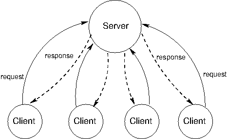

## Distributed Computing

Large-scale data processing applications often coordinate effort among multiple computers. A distributed computing application is one in which multiple interconnected but independent computers coordinate to perform a joint computation.

Different computers are independent in the sense that they do not directly share memory. Instead, they communicate with each other using *messages*, information transferred from one computer to another over a network.

## Messages

Messages sent between computers are sequences of bytes. The purpose of a message varies; messages can request data, send data, or instruct another computer to evaluate a procedure call. In all cases, the sending computer must encode information in a way that the receiving computer can decode and correctly interpret. To do so, computers adopt a message protocol that endows meaning to sequences of bytes.

A *message protocol* is a set of rules for encoding and interpreting messages. Both the sending and receiving computers must agree on the semantics of a message to enable successful communication. Many message protocols specify that a message conform to a particular format in which certain bits at fixed positions indicate fixed conditions. Others use special bytes or byte sequences to delimit parts of the message, much as punctuation delimits sub-expressions in the syntax of a programming language.

Message protocols are not particular programs or software libraries. Instead, they are rules that can be applied by a variety of programs, even written in different programming languages. As a result, computers with vastly different software systems can participate in the same distributed system, simply by conforming to the message protocols that govern the system.

**The TCP/IP Protocols**. On the Internet, messages are transferred from one machine to another using the [Internet Protocol](http://en.wikipedia.org/wiki/Internet_Protocol) (IP), which specifies how to transfer *packets* of data among different networks to allow global Internet communication. IP was designed under the assumption that networks are inherently unreliable at any point and dynamic in structure. Moreover, it does not assume that any central tracking or monitoring of communication exists. Each packet contains a header containing the destination IP address, along with other information. All packets are forwarded throughout the network toward the destination using simple routing rules on a best-effort basis.

This design imposes constraints on communication. Packets transferred using modern IP implementations (IPv4 and IPv6) have a maximum size of 65,535 bytes. Larger data values must be split among multiple packets. The IP does not guarantee that packets will be received in the same order that they were sent. Some packets may be lost, and some packets may be transmitted multiple times.

The [Transmission Control Protocol](http://en.wikipedia.org/wiki/Transmission_Control_Protocol) is an abstraction defined in terms of the IP that provides reliable, ordered transmission of arbitrarily large byte streams. The protocol provides this guarantee by correctly ordering packets transferred by the IP, removing duplicates, and requesting retransmission of lost packets. This improved reliability comes at the expense of latency, the time required to send a message from one point to another.

The TCP breaks a stream of data into *TCP segments*, each of which includes a portion of the data preceded by a header that contains sequence and state information to support reliable, ordered transmission of data. Some TCP segments do not include data at all, but instead establish or terminate a connection between two computers.

Establishing a connection between two computers `A` and `B` proceeds in three steps:

1. `A` sends a request to a *port* of `B` to establish a TCP connection, providing a *port number* to which to send the response.
2. `B` sends a response to the port specified by `A` and waits for its response to be acknowledged.
3. `A` sends an acknowledgment response, verifying that data can be transferred in both directions.

After this three-step "handshake", the TCP connection is established, and `A` and `B` can send data to each other. Terminating a TCP connection proceeds as a sequence of steps in which both the client and server request and acknowledge the end of the connection.

## Client/Server Architecture

The client/server architecture is a way to dispense a service from a central source. A *server* provides a service and multiple *clients* communicate with the server to consume that service. In this architecture, clients and servers have different roles. The server's role is to respond to service requests from clients, while a client's role is to issue requests and make use of the server's response in order to perform some task. The diagram below illustrates the architecture.



The most influential use of the model is the modern World Wide Web. When a web browser displays the contents of a web page, several programs running on independent computers interact using the client/server architecture. This section describes the process of requesting a web page in order to illustrate central ideas in client/server distributed systems.

**Roles**. The web browser application on a Web user's computer has the role of the client when requesting a web page. When requesting the content from a domain name on the Internet, such as www.nytimes.com, it must communicate with at least two different servers.

The client first requests the Internet Protocol (IP) address of the computer located at that name from a Domain Name Server (DNS). A DNS provides the service of mapping domain names to IP addresses, which are numerical identifiers of machines on the Internet. Python can make such a request directly using the `socket` module.

```python
>>> from socket import gethostbyname
>>> gethostbyname('www.nytimes.com')
'170.149.172.130'
```

The client then requests the contents of the web page from the web server located at that IP address. The response in this case is an [HTML](http://en.wikipedia.org/wiki/HTML) document that contains headlines and article excerpts of the day's news, as well as expressions that indicate how the web browser client should lay out that contents on the user's screen. Python can make the two requests required to retrieve this content using the `urllib.request` module.

```python
>>> from urllib.request import urlopen
>>> response = urlopen('http://www.nytimes.com').read()
>>> response[:15]
b'<!DOCTYPE html>'
```

Upon receiving this response, the browser issues additional requests for images, videos, and other auxiliary components of the page. These requests are initiated because the original HTML document contains addresses of additional content and a description of how they embed into the page.

**An HTTP Request**. The Hypertext Transfer Protocol (HTTP) is a protocol implemented using TCP that governs communication for the World Wide Web (WWW). It assumes a client/server architecture between a web browser and a web server. HTTP specifies the format of messages exchanged between browsers and servers. All web browsers use the HTTP format to request pages from a web server, and all web servers use the HTTP format to send back their responses.

HTTP requests have several types, the most common of which is a `GET` request for a specific web page. A `GET` request specifies a location. For instance, typing the address `http://en.wikipedia.org/wiki/UC_Berkeley` into a web browser issues an HTTP `GET` request to port 80 of the web server at `en.wikipedia.org` for the contents at location `/wiki/UC_Berkeley`.

The server sends back an HTTP response:

```http
HTTP/1.1 200 OK
Date: Mon, 23 May 2011 22:38:34 GMT
Server: Apache/1.3.3.7 (Unix) (Red-Hat/Linux)
Last-Modified: Wed, 08 Jan 2011 23:11:55 GMT
Content-Type: text/html; charset=UTF-8

... web page content ...
```

On the first line, the text `200 OK` indicates that there were no errors in responding to the request. The subsequent lines of the header give information about the server, the date, and the type of content being sent back.

If you have typed in a wrong web address, or clicked on a broken link, you may have seen a message such as this error:

```http
404 Error File Not Found
```

It means that the server sent back an HTTP header that started:

```http
HTTP/1.1 404 Not Found
```

The numbers 200 and 404 are HTTP response codes. A fixed set of response codes is a common feature of a message protocol. Designers of protocols attempt to anticipate common messages that will be sent via the protocol and assign fixed codes to reduce transmission size and establish a common message semantics. In the HTTP protocol, the 200 response code indicates success, while 404 indicates an error that a resource was not found. A variety of other [response codes](http://en.wikipedia.org/wiki/List_of_HTTP_status_codes) exist in the HTTP 1.1 standard as well.

**Modularity**. The concepts of *client* and *server* are powerful abstractions. A server provides a service, possibly to multiple clients simultaneously, and a client consumes that service. The clients do not need to know the details of how the service is provided, or how the data they are receiving is stored or calculated, and the server does not need to know how its responses are going to be used.

On the web, we think of clients and servers as being on different machines, but even systems on a single machine can have client/server architectures. For example, signals from input devices on a computer need to be generally available to programs running on the computer. The programs are clients, consuming mouse and keyboard input data. The operating system's device drivers are the servers, taking in physical signals and serving them up as usable input. In addition, the central processing unit (CPU) and the specialized graphical processing unit (GPU) often participate in a client/server architecture with the CPU as the client and the GPU as a server of images.

A drawback of client/server systems is that the server is a single point of failure. It is the only component with the ability to dispense the service. There can be any number of clients, which are interchangeable and can come and go as necessary.

Another drawback of client-server systems is that computing resources become scarce if there are too many clients. Clients increase the demand on the system without contributing any computing resources.

## Peer-to-Peer Systems

The client/server model is appropriate for service-oriented situations. However, there are other computational goals for which a more equal division of labor is a better choice. The term *peer-to-peer* is used to describe distributed systems in which labor is divided among all the components of the system. All the computers send and receive data, and they all contribute some processing power and memory. As a distributed system increases in size, its capacity of computational resources increases. In a peer-to-peer system, all components of the system contribute some processing power and memory to a distributed computation.

Division of labor among all participants is the identifying characteristic of a peer-to-peer system. This means that peers need to be able to communicate with each other reliably. In order to make sure that messages reach their intended destinations, peer-to-peer systems need to have an organized network structure. The components in these systems cooperate to maintain enough information about the locations of other components to send messages to intended destinations.

In some peer-to-peer systems, the job of maintaining the health of the network is taken on by a set of specialized components. Such systems are not pure peer-to-peer systems, because they have different types of components that serve different functions. The components that support a peer-to-peer network act like scaffolding: they help the network stay connected, they maintain information about the locations of different computers, and they help newcomers take their place within their neighborhood.

The most common applications of peer-to-peer systems are data transfer and data storage. For data transfer, each computer in the system contributes to send data over the network. If the destination computer is in a particular computer's neighborhood, that computer helps send data along. For data storage, the data set may be too large to fit on any single computer, or too valuable to store on just a single computer. Each computer stores a small portion of the data, and there may be multiple copies of the same data spread over different computers. When a computer fails, the data that was on it can be restored from other copies and put back when a replacement arrives.

Skype, the voice- and video-chat service, is an example of a data transfer application with a peer-to-peer architecture. When two people on different computers are having a Skype conversation, their communications are transmitted through a peer-to-peer network. This network is composed of other computers running the Skype application. Each computer knows the location of a few other computers in its neighborhood. A computer helps send a packet to its destination by passing it on a neighbor, which passes it on to some other neighbor, and so on, until the packet reaches its intended destination. Skype is not a pure peer-to-peer system. A scaffolding network of *supernodes* is responsible for logging-in and logging-out users, maintaining information about the locations of their computers, and modifying the network structure when users enter and exit.