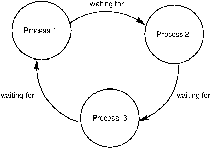

## Parallel Computing

From the 1970s through the mid-2000s, the speed of individual processor cores grew at an exponential rate. Much of this increase in speed was accomplished by increasing the *clock frequency*, the rate at which a processor performs basic operations. In the mid-2000s, however, this exponential increase came to an abrupt end, due to power and thermal constraints, and the speed of individual processor cores has increased much more slowly since then. Instead, CPU manufacturers began to place multiple cores in a single processor, enabling more operations to be performed concurrently.

Parallelism is not a new concept. Large-scale parallel machines have been used for decades, primarily for scientific computing and data analysis. Even in personal computers with a single processor core, operating systems and interpreters have provided the abstraction of concurrency. This is done through *context switching*, or rapidly switching between different tasks without waiting for them to complete. Thus, multiple programs can run on the same machine concurrently, even if it only has a single processing core.

Given the current trend of increasing the number of processor cores, individual applications must now take advantage of parallelism in order to run faster. Within a single program, computation must be arranged so that as much work can be done in parallel as possible. However, parallelism introduces new challenges in writing correct code, particularly in the presence of shared, mutable state.

For problems that can be solved efficiently in the functional model, with no shared mutable state, parallelism poses few problems. Pure functions provide *referential transparency*, meaning that expressions can be replaced with their values, and vice versa, without affecting the behavior of a program. This enables expressions that do not depend on each other to be evaluated in parallel. As discussed in the previous section, the MapReduce framework allows functional programs to be specified and run in parallel with minimal programmer effort.

Unfortunately, not all problems can be solved efficiently using functional programming. The Berkeley View project has identified [thirteen common computational patterns](http://view.eecs.berkeley.edu/wiki/Dwarf_Mine) in science and engineering, only one of which is MapReduce. The remaining patterns require shared state.

In the remainder of this section, we will see how mutable shared state can introduce bugs into parallel programs and a number of approaches to prevent such bugs. We will examine these techniques in the context of two applications, a web [crawler](https://www.composingprograms.com/examples/parallel/crawler.py.html) and a particle [simulator](https://www.composingprograms.com/examples/parallel/particle.py.html).

## Parallelism in Python

Before we dive deeper into the details of parallelism, let us first explore Python's support for parallel computation. Python provides two means of parallel execution: threading and multiprocessing.

**Threading**. In *threading*, multiple "threads" of execution exist within a single interpreter. Each thread executes code independently from the others, though they share the same data. However, the CPython interpreter, the main implementation of Python, only interprets code in one thread at a time, switching between them in order to provide the illusion of parallelism. On the other hand, operations external to the interpreter, such as writing to a file or accessing the network, may run in parallel.

The `threading` module contains classes that enable threads to be created and synchronized. The following is a simple example of a multithreaded program:

```python
>>> import threading
>>> def thread_hello():
        other = threading.Thread(target=thread_say_hello, args=())
        other.start()
        thread_say_hello()
>>> def thread_say_hello():
        print('hello from', threading.current_thread().name)
>>> thread_hello()
hello from Thread-1
hello from MainThread
```

The `Thread` constructor creates a new thread. It requires a target function that the new thread should run, as well as the arguments to that function. Calling `start` on a `Thread` object marks it ready to run. The `current_thread` function returns the `Thread` object associated with the current thread of execution.

In this example, the prints can happen in any order, since we haven't synchronized them in any way.

**Multiprocessing**. Python also supports *multiprocessing*, which allows a program to spawn multiple interpreters, or *processes*, each of which can run code independently. These processes do not generally share data, so any shared state must be communicated between processes. On the other hand, processes execute in parallel according to the level of parallelism provided by the underlying operating system and hardware. Thus, if the CPU has multiple processor cores, Python processes can truly run concurrently.

The `multiprocessing` module contains classes for creating and synchronizing processes. The following is the hello example using processes:

```python
>>> import multiprocessing
>>> def process_hello():
        other = multiprocessing.Process(target=process_say_hello, args=())
        other.start()
        process_say_hello()
>>> def process_say_hello():
        print('hello from', multiprocessing.current_process().name)
>>> process_hello()
hello from MainProcess
>>> hello from Process-1
```

As this example demonstrates, many of the classes and functions in `multiprocessing` are analogous to those in `threading`. This example also demonstrates how lack of synchronization affects shared state, as the display can be considered shared state. Here, the interpreter prompt from the interactive process appears before the print output from the other process.

## The Problem with Shared State

To further illustrate the problem with shared state, let's look at a simple example of a counter that is shared between two threads:

```python
import threading
from time import sleep

counter = [0]

def increment():
    count = counter[0]
    sleep(0) # try to force a switch to the other thread
    counter[0] = count + 1

other = threading.Thread(target=increment, args=())
other.start()
increment()
print('count is now: ', counter[0])
```

In this program, two threads attempt to increment the same counter. The CPython interpreter can switch between threads at almost any time. Only the most basic operations are *atomic*, meaning that they appear to occur instantly, with no switch possible during their evaluation or execution. Incrementing a counter requires multiple basic operations: read the old value, add one to it, and write the new value. The interpreter can switch threads between any of these operations.

In order to show what happens when the interpreter switches threads at the wrong time, we have attempted to force a switch by sleeping for 0 seconds. When this code is run, the interpreter often does switch threads at the `sleep` call. This can result in the following sequence of operations:

```python
Thread 0                    Thread 1
read counter[0]: 0
                            read counter[0]: 0
calculate 0 + 1: 1
write 1 -> counter[0]
                            calculate 0 + 1: 1
                            write 1 -> counter[0]
```

The end result is that the counter has a value of 1, even though it was incremented twice! Worse, the interpreter may only switch at the wrong time very rarely, making this difficult to debug. Even with the `sleep` call, this program sometimes produces a correct count of 2 and sometimes an incorrect count of 1.

This problem arises only in the presence of shared data that may be mutated by one thread while another thread accesses it. Such a conflict is called a *race condition*, and it is an example of a bug that only exists in the parallel world.

In order to avoid race conditions, shared data that may be mutated and accessed by multiple threads must be protected against concurrent access. For example, if we can ensure that thread 1 only accesses the counter after thread 0 finishes accessing it, or vice versa, we can guarantee that the right result is computed. We say that shared data is *synchronized* if it is protected from concurrent access. In the next few subsections, we will see multiple mechanisms providing synchronization.

## When No Synchronization is Necessary

In some cases, access to shared data need not be synchronized, if concurrent access cannot result in incorrect behavior. The simplest example is read-only data. Since such data is never mutated, all threads will always read the same values regardless when they access the data.

In rare cases, shared data that is mutated may not require synchronization. However, understanding when this is the case requires a deep knowledge of how the interpreter and underlying software and hardware work. Consider the following example:

```python
items = []
flag = []

def consume():
    while not flag:
        pass
    print('items is', items)

def produce():
    consumer = threading.Thread(target=consume, args=())
    consumer.start()
    for i in range(10):
        items.append(i)
    flag.append('go')

produce()
```

Here, the producer thread adds items to `items`, while the consumer waits until `flag` is non-empty. When the producer finishes adding items, it adds an element to `flag`, allowing the consumer to proceed.

In most Python implementations, this example will work correctly. However, a common optimization in other compilers and interpreters, and even the hardware itself, is to reorder operations within a single thread that do not depend on each other for data. In such a system, the statement `flag.append('go')` may be moved before the loop, since neither depends on the other for data. In general, you should avoid code like this unless you are certain that the underlying system won't reorder the relevant operations.

## Synchronized Data Structures

The simplest means of synchronizing shared data is to use a data structure that provides synchronized operations. The `queue` module contains a `Queue` class that provides synchronized first in, first out access to data. The `put` method adds an item to the `Queue`, and the `get` method retrieves an item. The class itself ensures that these methods are synchronized, so items are not lost no matter how thread operations are interleaved. Here is a producer/consumer example that uses a `Queue`:

```python
from queue import Queue

queue = Queue()

def synchronized_consume():
    while True:
        print('got an item:', queue.get())
        queue.task_done()

def synchronized_produce():
    consumer = threading.Thread(target=synchronized_consume, args=())
    consumer.daemon = True
    consumer.start()
    for i in range(10):
        queue.put(i)
    queue.join()

synchronized_produce()
```

There are a few changes to this code, in addition to the `Queue` and `get` and `put` calls. We have marked the consumer thread as a *daemon*, which means that the program will not wait for that thread to complete before exiting. This allows us to use an infinite loop in the consumer. However, we do need to ensure that the main thread exits, but only after all items have been consumed from the `Queue`. The consumer calls the `task_done` method to inform the `Queue` that it is done processing an item, and the main thread calls the `join` method, which waits until all items have been processed, ensuring that the program exits only after that is the case.

A more complex example that makes use of a `Queue` is a parallel web [crawler](https://www.composingprograms.com/examples/parallel/crawler.py.html) that searches for dead links on a website. This crawler follows all links that are hosted by the same site, so it must process a number of URLs, continually adding new ones to a `Queue` and removing URLs for processing. By using a synchronized `Queue`, multiple threads can safely add to and remove from the data structure concurrently.

## Locks

When a synchronized version of a particular data structure is not available, we have to provide our own synchronization. A *lock* is a basic mechanism to do so. It can be *acquired* by at most one thread, after which no other thread may acquire it until it is *released* by the thread that previously acquired it.

In Python, the `threading` module contains a `Lock` class to provide locking. A `Lock` has `acquire` and `release` methods to acquire and release the lock, and the class guarantees that only one thread at a time can acquire it. All other threads that attempt to acquire a lock while it is already being held are forced to wait until it is released.

For a lock to protect a particular set of data, all the threads need to be programmed to follow a rule: no thread will access any of the shared data unless it owns that particular lock. In effect, all the threads need to "wrap" their manipulation of the shared data in `acquire` and `release` calls for that lock.

In the parallel web [crawler](https://www.composingprograms.com/examples/parallel/crawler.py.html), a set is used to keep track of all URLs that have been encountered by any thread, so as to avoid processing a particular URL more than once (and potentially getting stuck in a cycle). However, Python does not provide a synchronized set, so we must use a lock to protect access to a normal set:

```python
seen = set()
seen_lock = threading.Lock()

def already_seen(item):
    seen_lock.acquire()
    result = True
    if item not in seen:
        seen.add(item)
        result = False
    seen_lock.release()
    return result
```

A lock is necessary here, in order to prevent another thread from adding the URL to the set between this thread checking if it is in the set and adding it to the set. Furthermore, adding to a set is not atomic, so concurrent attempts to add to a set may corrupt its internal data.

In this code, we had to be careful not to return until after we released the lock. In general, we have to ensure that we release a lock when we no longer need it. This can be very error-prone, particularly in the presence of exceptions, so Python provides a `with` compound statement that handles acquiring and releasing a lock for us:

```python
def already_seen(item):
    with seen_lock:
        if item not in seen:
            seen.add(item)
            return False
        return True
```

The `with` statement ensures that `seen_lock` is acquired before its suite is executed and that it is released when the suite is exited for any reason. (The `with` statement can actually be used for operations other than locking, though we won't cover alternative uses here.)

Operations that must be synchronized with each other must use the same lock. However, two disjoint sets of operations that must be synchronized only with operations in the same set should use two different lock objects to avoid over-synchronization.

## Barriers

Another way to avoid conflicting access to shared data is to divide a program into phases, ensuring that shared data is mutated in a phase in which no other thread accesses it. A *barrier* divides a program into phases by requiring all threads to reach it before any of them can proceed. Code that is executed after a barrier cannot be concurrent with code executed before the barrier.

In Python, the `threading` module provides a barrier in the form of the the `wait` method of a `Barrier` instance:

```python
counters = [0, 0]
barrier = threading.Barrier(2)

def count(thread_num, steps):
    for i in range(steps):
        other = counters[1 - thread_num]
        barrier.wait() # wait for reads to complete
        counters[thread_num] = other + 1
        barrier.wait() # wait for writes to complete

def threaded_count(steps):
    other = threading.Thread(target=count, args=(1, steps))
    other.start()
    count(0, steps)
    print('counters:', counters)

threaded_count(10)
```

In this example, reading and writing to shared data take place in different phases, separated by barriers. The writes occur in the same phase, but they are disjoint; this disjointness is necessary to avoid concurrent writes to the same data in the same phase. Since this code is properly synchronized, both counters will always be 10 at the end.

The multithreaded particle [simulator](https://www.composingprograms.com/examples/parallel/particle.py.html) uses a barrier in a similar fashion to synchronize access to shared data. In the simulation, each thread owns a number of particles, all of which interact with each other over the course of many discrete timesteps. A particle has a position, velocity, and acceleration, and a new acceleration is computed in each timestep based on the positions of the other particles. The velocity of the particle must be updated accordingly, and its position according to its velocity.

As with the simple example above, there is a read phase, in which all particles' positions are read by all threads. Each thread updates its own particles' acceleration in this phase, but since these are disjoint writes, they need not be synchronized. In the write phase, each thread updates its own particles' velocities and positions. Again, these are disjoint writes, and they are protected from the read phase by barriers.

## Message Passing

A final mechanism to avoid improper mutation of shared data is to entirely avoid concurrent access to the same data. In Python, using multiprocessing rather than threading naturally results in this, since processes run in separate interpreters with their own data. Any state required by multiple processes can be communicated by passing messages between processes.

The `Pipe` class in the `multiprocessing` module provides a communication channel between processes. By default, it is duplex, meaning a two-way channel, though passing in the argument `False` results in a one-way channel. The `send` method sends an object over the channel, while the `recv` method receives an object. The latter is *blocking*, meaning that a process that calls `recv` will wait until an object is received.

The following is a producer/consumer example using processes and pipes:

```python
def process_consume(in_pipe):
    while True:
        item = in_pipe.recv()
        if item is None:
            return
        print('got an item:', item)

def process_produce():
    pipe = multiprocessing.Pipe(False)
    consumer = multiprocessing.Process(target=process_consume, args=(pipe[0],))
    consumer.start()
    for i in range(10):
        pipe[1].send(i)
    pipe[1].send(None) # done signal

process_produce()
```

In this example, we use a `None` message to signal the end of communication. We also passed in one end of the pipe as an argument to the target function when creating the consumer process. This is necessary, since state must be explicitly shared between processes.

The multiprocess version of the particle [simulator](https://www.composingprograms.com/examples/parallel/particle.py.html) uses pipes to communicate particle positions between processes in each timestep. In fact, it uses pipes to set up an entire circular pipeline between processes, in order to minimize communication. Each process injects its own particles' positions into its pipeline stage, which eventually go through a full rotation of the pipeline. At each step of the rotation, a process applies forces from the positions that are currently in its own pipeline stage on to its own particles, so that after a full rotation, all forces have been applied to its particles.

The `multiprocessing` module provides other synchronization mechanisms for processes, including synchronized queues, locks, and as of Python 3.3, barriers. For example, a lock or a barrier can be used to synchronize printing to the screen, avoiding the improper display output we saw previously.

## Synchronization Pitfalls

While synchronization methods are effective for protecting shared state, they can also be used incorrectly, failing to accomplish the proper synchronization, over-synchronizing, or causing the program to hang as a result of deadlock.

**Under-synchronization**. A common pitfall in parallel computing is to neglect to properly synchronize shared accesses. In the set example, we need to synchronize the membership check and insertion together, so that another thread cannot perform an insertion in between these two operations. Failing to synchronize the two operations together is erroneous, even if they are separately synchronized.

**Over-synchronization**. Another common error is to over-synchronize a program, so that non-conflicting operations cannot occur concurrently. As a trivial example, we can avoid all conflicting access to shared data by acquiring a master lock when a thread starts and only releasing it when a thread completes. This serializes our entire code, so that nothing runs in parallel. In some cases, this can even cause our program to hang indefinitely. For example, consider a consumer/producer program in which the consumer obtains the lock and never releases it. This prevents the producer from producing any items, which in turn prevents the consumer from doing anything since it has nothing to consume.

While this example is trivial, in practice, programmers often over-synchronize their code to some degree, preventing their code from taking complete advantage of the available parallelism.

**Deadlock**. Because they cause threads or processes to wait on each other, synchronization mechanisms are vulnerable to *deadlock*, a situation in which two or more threads or processes are stuck, waiting for each other to finish. We have just seen how neglecting to release a lock can cause a thread to get stuck indefinitely. But even if threads or processes do properly release locks, programs can still reach deadlock.

The source of deadlock is a *circular wait*, illustrated below with processes. No process can continue because it is waiting for other processes that are waiting for it to complete.



As an example, we will set up a deadlock with two processes. Suppose they share a duplex pipe and attempt to communicate with each other as follows:

```python
def deadlock(in_pipe, out_pipe):
    item = in_pipe.recv()
    print('got an item:', item)
    out_pipe.send(item + 1)

def create_deadlock():
    pipe = multiprocessing.Pipe()
    other = multiprocessing.Process(target=deadlock, args=(pipe[0], pipe[1]))
    other.start()
    deadlock(pipe[1], pipe[0])

create_deadlock()
```

Both processes attempt to receive data first. Recall that the `recv` method blocks until an item is available. Since neither process has sent anything, both will wait indefinitely for the other to send it data, resulting in deadlock.

Synchronization operations must be properly aligned to avoid deadlock. This may require sending over a pipe before receiving, acquiring multiple locks in the same order, and ensuring that all threads reach the right barrier at the right time.

## Conclusion

As we have seen, parallelism presents new challenges in writing correct and efficient code. As the trend of increasing parallelism at the hardware level will continue for the foreseeable future, parallel computation will become more and more important in application programming. There is a very active body of research on making parallelism easier and less error-prone for programmers. Our discussion here serves only as a basic introduction to this crucial area of computer science.