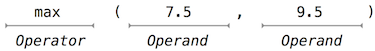
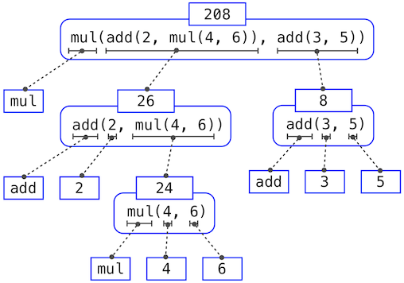

# 开始

计算机科学是一门极其广泛的学科，每年，全球的分布式系统、人工智能、机器人、图形学、安全、科学计算、计算机体系结构以及更多新兴的二级领域都会随着计算机科学的新技术和新发现而扩展。计算机科学的迅猛发展已经深刻地改变了人类生活的各个层面。商业、通信、科学、艺术、娱乐和政治都在计算的领域中得到了新的定义。

之所以计算机科学的巨大生产力能够成为可能，都是因为其建立在一套优雅而强大的基本思想之上。所有计算都始于三点：信息的表示、处理的逻辑、设计抽象来管理逻辑的复杂性，掌握这些基础知识需要我们去精确理解计算机程序的构造和解释。

## Python 编程

> A language isn't something you learn so much as something you join.
>
> — [Arika Okrent](http://arikaokrent.com/)

为了定义计算过程，我们需要一种被人们广泛使用和各类电脑广泛接受的编程语言，在本文中，我们将主要使用 [Python](http://docs.python.org/py3k/) 语言。

Python 是一种被广泛使用的编程语言，其吸引了来自各行各业的爱好者：Web 程序员、游戏工程师、科学家、学者甚至是新语言的设计者。当你学习 Python 时，你就加入到了一个拥有着百万开发人员的社区。开发者社区是非常重要的组织：成员可以互相帮助解决问题，分享他们的项目和经验，共同开发软件和工具。经常会有一些专注的成员因其贡献而获得名誉和广泛的尊重。

Python 语言本身是一个大型志愿者社区的产物，它以其贡献者的 [多元化](http://python.org/community/diversity/) 为傲。该语言由 [Guido van Rossum](http://en.wikipedia.org/wiki/Guido_van_Rossum) 在 20 世纪 80 年代末构思并实现，他在  [Python 3 教程](http://docs.python.org/py3k/tutorial/appetite.html)  的第一章中解释了 Python 在当今的众多语言中受欢迎的原因。

Python 作为一种教学语言非常出色，因为在其整个历史中，Python 的开发人员一直在强调 Python 代码的人类可解释性，并在 [Python 之禅](http://www.python.org/dev/peps/pep-0020/) 的美观、简约和可读的原则下进一步加强。因为它宽泛的特性能够支持各种不同的编程风格，所以十分适合本书，我们将在之后逐一探讨这些风格。从来没有单一的 Python 编程方法，但遵守开发人员社区共享的一组约定会有助于现有程序的阅读、理解和扩展。Python 巨大的灵活性和易学性可以使学生探索许多编程范式，然后将获得的新知识应用到数以千计的 [正在进行的项目](http://pypi.python.org/pypi) 中。

## 安装 Python 3

与所有伟大的软件一样，Python 有很多版本，而本文将使用最新稳定版本的 Python 3。许多计算机已经安装了旧版本的 Python，如 Python 2.7，它们与本文要求不符，你需要使用任意安装了 Python 3 的计算机（别担心，Python 是免费的）。

你可以从 Python 下载页面点击以 3 开头的版本下载 Python 3，并按照安装程序的说明完成安装。

如需进一步指导，请观看由 Julia Oh 创建的有关 Python 3 的 [Windows 安装](http://www.youtube.com/watch?v=54-wuFsPi0w) 和 [Mac 安装](http://www.youtube.com/watch?v=smHuBHxJdK8) 的视频教程。

## 交互式会话

在与 Python 的交互式会话中，你可以在提示符 `>>>` 后键入一些 Python 代码，Python 解释器会读取并执行你键入的各种命令。

要启动交互式会话，请在终端 (Mac/Unix/Linux) 中键入 `python3` 或在 Windows 中打开 Python 3 应用程序。

如果你看到了 Python 提示符 `>>>`，则已经成功启动交互式会话。我们会使用提示符和一些输入来展示示例。

```python
>>> 2 + 2
4
```

**交互控制**：每个会话都会保留键入内容的历史记录，可以按下 `<Control>-P`（上一个）和 `<Control>-N`（下一个）浏览该历史记录。使用 `<Control>-D` 会退出会话并丢弃此历史记录。在某些系统上，上、下箭头也可以用于循环浏览历史记录。

## 第一个例子

> And, as imagination bodies forth
>
> The forms of things to unknown, and the poet's pen
>
> Turns them to shapes, and gives to airy nothing
>
> A local habitation and a name.
>
> — William Shakespeare, A Midsummer-Night's Dream

本节将以一个使用“多种语言特性”的示例来介绍 Python，你可以将此部分视为即将到来的功能的预览，在下一节中，我们将从头开始逐步了解整个语言。

Python 内置了一些常见编程功能，例如处理文本、显示图形以及通过互联网进行通信。下面这行 Python 代码

```python
>>> from urllib.request import urlopen
```

是一个 `import` 语句，它会导入一个用于“访问互联网数据”的功能，该功能特别提供了一个名为 `urlopen` 的函数，可以访问 URL（也就是访问互联网上的某个网址）上的内容。

**语句和表达式**：Python 代码由表达式和语句组成，从广义上讲，计算机程序由以下指令组成

1. 计算一些值
2. 执行一些操作

语句通常描述操作，Python 解释器每执行一条语句，计算机就会执行相应的操作。另外，表达式通常用于描述计算，当 Python 计算一个表达式时，它会计算出该式的值。本章会介绍语句和表达式的几种类型。

下面的赋值语句

```python
>>> shakespeare = urlopen('https://www.composingprograms.com/shakespeare.txt')
```

将名称 `shakespeare` 与 `=` 后面的表达式的值相连，这个表达式将 `urlopen` 函数应用在了一个包含莎士比亚 37 部戏剧完整文本的 URL 上。

**函数**：函数封装了操作数据的逻辑。`urlopen` 就是一个函数，而网址是一个数据，莎士比亚的戏剧是另一个数据。从前者到后者的转换过程可能会很复杂，但我们可以将这种复杂性隐藏在一个函数中，从而能够使用一个简单的表达式来跳过该过程。函数是本章的主题。

另一个赋值语句

```python
>>> words = set(shakespeare.read().decode().split())
```

将 `words` 与莎士比亚戏剧中出现的共 33,721 个单词的集合相连。其命令链调用了 `read`、`decode` 和 `split`，每个函数都会操作一个中间的计算实体：从 URL 中 `read`（读取）数据，然后将数据 `decode` （解码）为文本，最后将文本 `split` （拆分）为单词放在一个 `set` 中。

**对象**：`set` 就是一种对象，支持如计算交集和集合关系（membership）等运算。对象无缝整合了数据以及用于操作该数据的逻辑，并隐藏了二者的复杂性。对象是第二章的主题。

最后，这个表达式

```python
>>> {w for w in words if len(w) == 6 and w[::-1] in words}
{'redder', 'drawer', 'reward', 'diaper', 'repaid'}
```

是一个复合表达式，它的计算结果是反向拼写同时也为单词的莎士比亚单词集合。神秘符号 `w[::-1]` 表示枚举单词中的每个字母，其中 -1 代表反向枚举。当你在交互式会话中输入表达式时，Python 会在下一行打印它的值。

**解释器**：复合表达式的求解需要以一个可预测的方式来精确解释代码的过程。实现这样的过程，用于计算复合表达式的程序就称为解释器。解释器的设计和实现是第三章的主题。

与其他计算机程序相比，编程语言的解释器具有独特的通用性。Python 在设计时并不会考虑莎士比亚，但它的高度灵活性使我们能够只用少量的语句和表达式来处理大量的文本。

最后，我们会发现所有这些核心概念都是紧密相关的：函数是对象，对象是函数，解释器是二者的实例。但是，清楚地理解每一个概念及其在组织代码中的作用对于掌握编程艺术至关重要。

## 编程要素

编程语言不仅是一种指挥计算机执行任务的手段，它还应该成为一种框架，使我们能够在其中组织自己有关计算过程的思想。程序也用于在编程社区的成员之间传达想法，所以程序必须是人类可以阅读的，并且“恰巧”能被机器执行。

这样，当我们描述一种语言时，就需要特别注意该语言所提供的能够将简单思想组合成复杂思想的工具。每一种强大的语言都有这样三种机制：

- **原始表达式和语句**：语言所关心的最简单的个体
- **组合方法**：由简单元素组合构建复合元素
- **抽象方法**：命名复合元素，并将其作为单元进行操作

在编程中，我们只会处理两种元素：函数和数据（之后你会发现它们实际上并不是泾渭分明的），不那么正式的说法是：数据是我们想要操作的东西，而函数是操作这些数据的规则的描述。因此，任何强大的编程语言都必须能表达基本的数据和函数，并且提供对函数和数据进行组合和抽象的方法。

## 表达式

上一节中，我们完整尝试了 Python 解释器，而下面我们将重新开始，一步步地讲解 Python 语言。如果示例看起来过于简单，请耐心等待，更令人振奋的东西在后面呢。

我们从一种基本表达式“数字 number”开始，更准确地说，是你键入的，十进制数字组成的表达式。

```python
>>> 42
42
```

表达式表示的数字可以与数学运算符组合形成一个复合表达式，解释器将对其进行求值：

```python
>>> -1 - -1
0
>>> 1/2 + 1/4 + 1/8 + 1/16 + 1/32 + 1/64 + 1/128
0.9921875
```

这些数学表达式使用中缀表示法（infix notation），运算符（例如 +、-、* 或 /）出现在操作数之间。Python 包含许多种形成复合表达式的方法，我们会在学习中慢慢引入新的表达式形式和它们所支持的语言特性，而不是立即把它们列举出来。

## 调用表达式

最重要的一种复合表达式是调用表达式，它将函数运用于一些参数上。回想一下代数中的函数的数学概念：函数就是从一些输入参数到输出值的映射。例如，`max` 函数会输出一个最大的输入值，也就是将多个输入映射到了单个输出上。Python 中函数应用的方式与传统数学相同。

py

```python
>>> max(7.5, 9.5)
9.5
```

这个调用表达式包含子表达式（subexpressions）：在括号之前是一个运算符表达式，而括号里面是一个以逗号分隔的操作数表达式的列表。



运算符指定了一个函数，在对这个调用表达式进行求值时，我们会说：使用参数 7.5 和 9.5 来调用函数 `max`，最后返回 9.5。

调用表达式中参数的顺序是很重要的。例如，`pow` 函数的第二个参数是第一个参数的幂。

```python
>>> pow(100, 2)
10000
>>> pow(2, 100)
1267650600228229401496703205376
```

函数符号相比传统的中缀数学符号有三个主要优点。首先，因为函数名总是在参数前面，函数可以接收任意数量的参数而不会产生歧义。

```python
>>> max(1, -2, 3, -4)
3
```

其次，函数可以直接扩展为嵌套（nested）表达式，其元素本身就是复合表达式。不同于中缀复合表达式，调用表达式的嵌套结构在括号中是完全明确的。

```python
>>> max(min(1, -2), min(pow(3, 5), -4))
-2
```

这种嵌套的深度（理论上）没有任何限制，Python 解释器可以解释任何复杂的表达式。但人类很快就会被多层嵌套搞晕，所以作为一个程序员，你的一个重要目标就是：构造你自己、你的编程伙伴和其他任何可能阅读你代码的人都可以解释的表达式。

第三点，数学符号在形式上多种多样：星号表示乘法，上标表示幂指数，水平横杠表示除法，带有倾斜壁板的屋顶表示平方根，而其中一些符号很难被输入！但是，所有这些复杂事物都可以通过调用表达式的符号来进行统一。Python 除了支持常见的中缀数学符号（如 + 和 -）之外，其他任何运算符都可以表示为一个带有名称的函数。

## 导入库函数

Python 定义了大量的函数，包括上一节中提到的运算符函数，但默认情况下我们不能直接使用名字来调用它们。Python 将已知函数和其他东西组织起来放入到了模块中，而这些模块共同组成了 Python 库。我们要使用的时候需要导入它们，例如，`math` 模块提供了各种熟悉的数学函数：

```
>>> from math import sqrt
>>> sqrt(256)
16.0
```

`operator` 模块提供了中缀运算符对应的函数：

```python
>>> from operator import add, sub, mul
>>> add(14, 28)
42
>>> sub(100, mul(7, add(8, 4)))
16
```

`import` 语句需要指定模块名称（例如 `operator` 或  `math`），然后列出要导入该模块里的具名函数（例如 `sqrt`）。一个函数被导入后就可以被多次调用。

使用运算符函数（例如 `add`）和运算符号（例如  +）之间并没有任何区别。按照惯例来说，大多数程序员使用符号和中缀表示法来表达简单的算术。

[Python 3 库文档](http://docs.python.org/py3k/library/index.html) 列出了每个模块中定义的函数，例如 [math 模块](http://docs.python.org/py3k/library/math.html)。但是，该文档是为熟悉整个语言的开发人员编写的。现在来说，尝试使用函数可能会比阅读文档更能使你了解函数的行为。而当你熟悉了 Python 语言和词汇时，这个文档就将会成为你宝贵的参考资料。

##  名称与环境

编程语言的一个要素就是使用名称来引用计算对象，如果一个值被赋予了名称，我们说名称绑定到了值上面。

在 Python 中，我们可以使用赋值语句建立新的绑定，`=` 左边是名称，右边是值。

```python
>>> radius = 10
>>> radius
10
>>> 2 * radius
20
```

名称也可以通过 `import` 语句绑定。

```python
>>> from math import pi
>>> pi * 71 / 223
1.0002380197528042
```

`=` 在 Python 中称为 **赋值** 符号（即 assignment operator，许多其他语言也是如此），赋值是最简单的 **抽象** 方法，因为它允许我们使用简单名称来指代复合操作的结果，例如上面计算的 `area`。这样，复杂的程序由复杂性递增的计算对象逐步构建。

将名称与值绑定，之后通过名称检索可能的值，就意味着解释器必须维护某种内存来记录名称、值和绑定，这种内存就是环境（environment）。

名称也可以与函数绑定。例如，名称 `max` 就和我们之前使用的 `max` 函数进行了绑定。与数字不同，函数很难以文本呈现，因此当询问一个函数时，Python 会打印一个标识来描述：

```python
>>> max
<built-in function max>
```

赋值语句可以为现有函数赋予新名称。

```python
>>> f = max
>>> f
<built-in function max>
>>> f(2, 3, 4)
4
```

之后再次赋值可以将已有名称与新值绑定。

```python
>>> f = 2
>>> f
2
```

在 Python 中，名称通常被称为“变量名 variable names”或“变量 variables”，因为它们可以在执行程序的过程中与不同的值绑定。当一个变量通过赋值语句与一个新值绑定，它就不再绑定以前的值。你甚至可以将内置名称与新值绑定。

```python
>>> max = 5
>>> max
5
```

将 `max` 赋值为 5 后，名称 `max` 不再绑定函数，因此调用 `max(2, 3, 4)` 将导致错误。

执行赋值语句时，Python 会先求解 `=` 右侧的表达式，再将结果与左侧的名称绑定，所以可以在右侧表达式中引用一个已绑定的变量。

```python
>>> x = 2
>>> x = x + 1
>>> x
3
```

还可以在单个语句中为多个变量分配值，左右都用逗号隔开。

```python
>>> area, circumference = pi * radius * radius, 2 * pi * radius
>>> area
314.1592653589793
>>> circumference
62.83185307179586
```

更改一个变量的值不会影响其他变量。即使下列代码中 `area` 的值由最初定义的 `radius` 绑定，但改变 `radius` 的值并不能更新 `area` 的值，我们需要另一个赋值语句来更新它。

```python
>>> radius = 11
>>> area
314.1592653589793
>>> area = pi * radius * radius
380.132711084365
```

对于多重赋值，所有 `=` 右边的表达式都会先求值，然后再与左边的名称绑定。在这个规则下，我们可以在单个语句内交换两个变量的值。

```python
>>> x, y = 3, 4.5
>>> y, x = x, y
>>> x
4.5
>>> y
3
```

## 求解嵌套表达式

本章的目标之一是在“以程序的角度思考”中隔离其他的问题，举一个恰当的例子，就是思考一下在求解嵌套表达式时，解释器自身的操作过程。

为了求值一个表达式，Python 将执行以下操作：

- 求解运算符子表达式和操作数子表达式
- 然后将操作数子表达式的值作为运算符子表达式的函数的参数

这个简单的过程也说明了有关流程的一些要点。第一步规定：为了求出调用表达式，必须首先求出其他表达式。因此，求值程序本质上是 **递归** 的，也就是说它会自己调用自己作为步骤之一。

例如，此式需要应用四次求值过程。

```python
>>> sub(pow(2, add(1, 10)), pow(2, 5))
2016
```

如果把每个需要求解的表达式都抽出来，我们可以看到这个求值过程的层次结构。



这个图叫做表达式树，在计算机科学中，树通常从上到下增长。树中每个点的对象都叫做节点。这里节点分别是表达式和表达式的值。

求解根节点（即顶部的完整表达式），需要首先求解子表达式，也就是分支节点。叶子节点（也就是没有分支的节点）表示函数或数值。内部节点有两部分：我们想要应用的求值规则的调用表达式，以及该表达式的结果。观察这棵树的求解过程，我们可以想象操作数的值会向上流动，从叶子节点开始一步步向上组合。

接下来，观察第一步的重复应用，将我们带到我们需要求解的原始表达式，而不是调用表达式，例如数字（例如 2）和名称（例如  add）。我们规定基本逻辑为：

- 数字的值就是它们所表示的数值
- 名称的值是环境中关联此名称的对象

注意环境在决定表达式中的符号意义上有重要作用。在 Python 中，不指定任何环境信息去谈论一个值是没有意义的，例如名称 `x` 和 `add`。环境为求解提供了上下文信息，对理解程序执行过程有着重要作用。

```python
>>> add(x, 1)
```

这个求解步骤并不能对所有 Python 代码求值，它仅能求解调用表达式、数字和名称。例如，它并不能处理赋值语句。

```python
>>> x = 3
```

因为赋值语句的目的是将名称与值绑定，它并不返回值，也不应用参数去求解函数。也就是说，赋值语句不被求解但“被执行”，它们只是做出一些改变但不产生值。每种类型的表达式或语句都有自己的求解或执行过程。

注意：当我们说“一个数字求解为一个数值”时，实际上是 Python 解释器将数字求解为数值，是解释器赋予了编程语言这个意义。鉴于解释器是一个始终表现一致的固定程序，我们就可以说数字（以及表达式）会在 Python 程序的上下文中被求解为值。

# 错误

Python 正在等待你的命令。即使你可能还不了解其完整的词汇和结构，我们仍鼓励你尝试使用该语言。当然也请你为错误做好准备，因为计算机在极其快速灵活的同时也十分古板。计算机的特性在  [斯坦福的入门课程](http://web.stanford.edu/class/cs101/code-1-introduction.html) 中被描述为

> The fundamental equation of computers is: `computer = powerful + stupid`
>
> Computers are very powerful, looking at volumes of data very quickly. Computers can perform billions of operations per second, where each operation is pretty simple.
>
> Computers are also shockingly stupid and fragile. The operations that they can do are extremely rigid, simple, and mechanical. The computer lacks anything like real insight ... it's nothing like the HAL 9000 from the movies. If nothing else, you should not be intimidated by the computer as if it's some sort of brain. It's very mechanical underneath it all.
>
> Programming is about a person using their real insight to build something useful, constructed out of these teeny, simple little operations that the computer can do.
>
> — Francisco Cai and Nick Parlante, Stanford CS101

当你尝试使用 Python 解释器时，计算机的古板会立即显现出来：即使是最小的拼写和格式更改也会导致预料之外的输出和错误。

学着解释错误和找到错误的原因称为调试，关于调试的一些指导原则是：

1. **增量测试**：每个编写良好的程序都由可以单独测试的小型模块化组件组成。尽快测试你已经编写的所有内容，以尽早发现问题并获得对组件的信心。
2. **隔离错误**：语句输出中的错误通常可归因于特定的模块化组件。所以在诊断问题时，先追踪错误到最小的代码片段，然后再试着修复问题。
3. **检查你的假设**：解释器会一字不漏地执行你的指示——不多也不少。当某些代码的行为与程序员假设的行为不匹配时，它们的输出就是不符合预期的。明确你的假设，然后将调试的工作集中在验证你的假设上。
4. **咨询别人**：你不是一个人！如果你不理解错误信息，请询问朋友、老师或搜索引擎。如果你已经找出了一个错误，但却不知道如何更正它，可以请其他人查看。在小组解决问题的过程中会分享很多有价值的编程知识。

增量测试、模块化设计、明确的假设和团队合作是贯穿本书的主题，希望它们也将贯穿你的计算机科学职业生涯。
