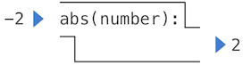

## 定义新的函数


我们已经在 Python 中确定了强大的编程语言中一些必须出现的要素：

1. 原始的内置数据和函数：数字和算术运算
2. 组合方式：嵌套函数
3. 受限的抽象方式：将名称与值绑定

现在我们来学习 **函数定义**，这是一种更为强大的抽象技术，通过它可以将名称与复合操作绑定为一个单元。

首先来研究一下 **平方** 的概念。我们可能会说：“平方就是一个数乘以它本身。”这在 Python 中可以表示为：

```python
>>> def square(x):
        return mul(x, x)
```

上面的代码定义了一个名为 `square` 的新函数，这个用户定义的函数并不会内置到解释器中，它表示将某值与自身相乘的复合运算。这个定义将 `x` 作为被乘的东西的名称，称为 **形式参数**，同时也将此函数与名称 `square` 绑定。

**如何定义函数**：函数定义包含 `def` 语句、`<name 函数名>` 和一个以逗号分隔的 `<formal parameters 形式参数>` 列表，然后是一个被称为函数体的 `return` 语句，它指定了调用函数时要计算的表达式，也就是函数的 `<return expression 返回表达式>` ：

```python
def <name>(<formal parameters>):
    return <return expression>
```

函数的第二行 **必须** 进行缩进，大多数程序员使用四个空格。返回表达式会作为新定义的函数的一部分存储，并且仅在最终调用该函数时才进行求值。

定义了 `square` 之后，我们可以调用它：

```python
>>> square(21)
441
>>> square(add(2, 5))
49
>>> square(square(3))
81
```

我们还可以将 `square` 作为一个构建单元来定义其他函数。例如，我们可以很容易地定义一个函数 `sum_squares`，给定任意两个数字作为参数，返回它们的平方和：

```python
>>> def sum_squares(x, y):
        return add(square(x), square(y))

>>> sum_squares(3, 4)
25
```

用户定义函数的使用方式与内置函数完全相同。实际上，从 `sum_squares` 的定义中我们并不能判断 `square` 是内置于解释器中，还是从模块中导入的，又或是用户定义的。

`def` 语句和赋值语句都将名称与值绑定，并且绑定后任何之前的绑定都将丢失。例如，下面的 `g` 首先指的是一个没有参数的函数，然后是指一个数字，最后是一个含有两个参数的函数。

```python
>>> def g():
        return 1
>>> g()
1
>>> g = 2
>>> g
2
>>> def g(h, i):
        return h + i
>>> g(1, 2)
3
```

## 非纯函数 print

在本节中，我们将区分两种类型的函数。

**纯函数（Pure functions）**：函数有一些输入（参数）并返回一些输出（调用返回结果）。

```python
>>> abs(-2)
2
```

可以将内置函数 `abs` 描述为接受输入并产生输出的小型机器。



`abs` 就是纯函数，纯函数在调用时除了返回值外不会造成其他任何影响，而且在使用相同的参数调用纯函数时总是会返回相同的值。

**非纯函数（Non-pure functions）**：除了返回值外，调用一个非纯函数还会产生其他改变解释器和计算机的状态的副作用（side effect）。一个常见的副作用就是使用 `print` 函数产生（非返回值的）额外输出。

```python
>>> print(1, 2, 3)
1 2 3
```

虽然  `print` 和  `abs` 在这些例子中看起来很相似，但它们的工作方式基本不同。`print` 返回的值始终为 `None`，这是一个不代表任何内容的特殊 Python 值。而交互式 Python 解释器并不会自动打印 `None` 值，所以 `print` 函数的额外输出就是它的副作用。


下面这个调用 `print` 的嵌套表达式就展示了非纯函数的特征。

```python
>>> print(print(1), print(2))
1
2
None None
```

如果你发现这个输出结果出乎你的意料，可以画一个表达式树来解释求解该表达式会产生特殊输出的原因。

小心使用  `print` 函数！它返回 `None` 意味着它不应该用于赋值语句。

```python
>>> two = print(2)
2
>>> print(two)
None
```

纯函数不能有副作用，或是随着时间推移的改变的限制，但是对其施加这些限制会产生巨大的好处。首先，纯函数可以更可靠地组成复合调用表达式。在上面的示例中可以看到在操作数表达式中使用非纯函数  `print` 并不能返回有用的结果，但另一方面，我们已经看到  `max, pow, sqrt` 等函数可以在嵌套表达式中有效使用。

第二，纯函数往往更易于测试。相同的参数列表会返回相同的值，我们可以将其与预期的返回值进行比较。

第三，第四章将说明纯函数对于编写可以同时计算多个调用表达式的并发程序来说是必不可少的。

此外，会研究一系列非纯函数并描述它们的用途。

## 环境

虽然我们现在的 Python 子集已经足够复杂，但程序的含义并不明显。如果形参与内置函数同名怎么办？两个函数可以共享名称而不会混淆吗？要解决这些问题，我们必须更详细地描述环境。

求解表达式的环境由 **帧** 序列组成，它们可以被描述为一些盒子。每个帧都包含了一些 **绑定**，它们将名称与对应的值相关联。**全局** 帧（global frame）只有一个。赋值和导入语句会将条目添加到当前环境的第一帧。目前，我们的环境仅由全局帧组成。

<iframe width="800" height="500" frameborder="0" src="https://pythontutor.com/iframe-embed.html#code=from%20math%20import%20pi%0Atau%20%3D%202%20*%20pi&codeDivHeight=400&codeDivWidth=350&cumulative=false&curInstr=0&heapPrimitives=nevernest&origin=opt-frontend.js&py=3&rawInputLstJSON=%5B%5D&textReferences=false"> </iframe>

此 **环境图** 显示了当前环境中的绑定，还有名称和值的绑定。本文中的环境图是交互式的：你可以逐步运行左侧程序的每一行，然后在右侧查看环境状态的演变。你还可以单击“Edit this code”以将示例加载到 [Online Python Tutor](https://www.composingprograms.com/tutor.html) 中，它是由 [Philip Guo](http://www.pgbovine.net/) 创建的用于生成环境图的工具。希望你能够自己去创建示例，研究对应生成的环境图。

函数也会出现在环境图中。`import` 语句将名称与内置函数绑定。`def` 语句将名称与用户自定义的函数绑定。导入 `mul` 并定义 `square` 后的结果环境如下所示：

<iframe width="800" height="500" frameborder="0" src="https://pythontutor.com/iframe-embed.html#code=from%20operator%20import%20mul%0Adef%20square%28x%29%3A%0A%20%20%20%20return%20mul%28x,%20x%29&codeDivHeight=400&codeDivWidth=350&cumulative=false&curInstr=0&heapPrimitives=nevernest&origin=opt-frontend.js&py=3&rawInputLstJSON=%5B%5D&textReferences=false"> </iframe>

每个函数都是一行，以 `func` 开头，后面是函数名称和形式参数。`mul` 等内置函数没有正式的参数名称，所以都是使用 `...` 代替。

函数名称重复两次，一次在环境帧中，另一次是作为函数定义的一部分。函数定义中出现的名称叫做 **内在名称（intrinsic name）**，帧中的名称叫做 **绑定名称（bound name）**。两者之间有一个区别：不同的名称可能指的是同一个函数，但该函数本身只有一个内在名称。

绑定到帧中的函数名称是在求值过程中使用，而内在名称在求值中不起作用。使用 Next 按钮逐步执行下面的示例，可以看到一旦名称 `max` 与数字值 3 绑定，它就不能再用作函数。

<iframe width="800" height="500" frameborder="0" src="https://pythontutor.com/iframe-embed.html#code=f%20%3D%20max%0Amax%20%3D%203%0Aresult%20%3D%20f%282,%203,%204%29%0Amax%281,%202%29%20%20%23%20Causes%20an%20error&codeDivHeight=400&codeDivWidth=350&cumulative=false&curInstr=4&heapPrimitives=nevernest&origin=opt-frontend.js&py=3&rawInputLstJSON=%5B%5D&textReferences=false"> </iframe>

错误信息“TypeError: 'int' object is not callable”报告了名称 `max` （当前绑定到数字 3）是一个整数而不是函数，所以它不能用作调用表达式中的运算符。

**函数签名**：每个函数允许采用的参数数量有所不同。为了跟踪这些要求，我们绘制了每个函数的名称及其形式参数。用户定义的函数 `square` 只需要 `x` 一个参数，提供或多或少的参数都将导致错误。对函数形式参数的描述被称为函数的签名。

函数 `max` 可以接受任意数量的参数，所以它被呈现为 `max(...)`。因为原始函数从未明确定义，所以无论采用多少个参数，所有的内置函数都将呈现为 `<name>(...)`。